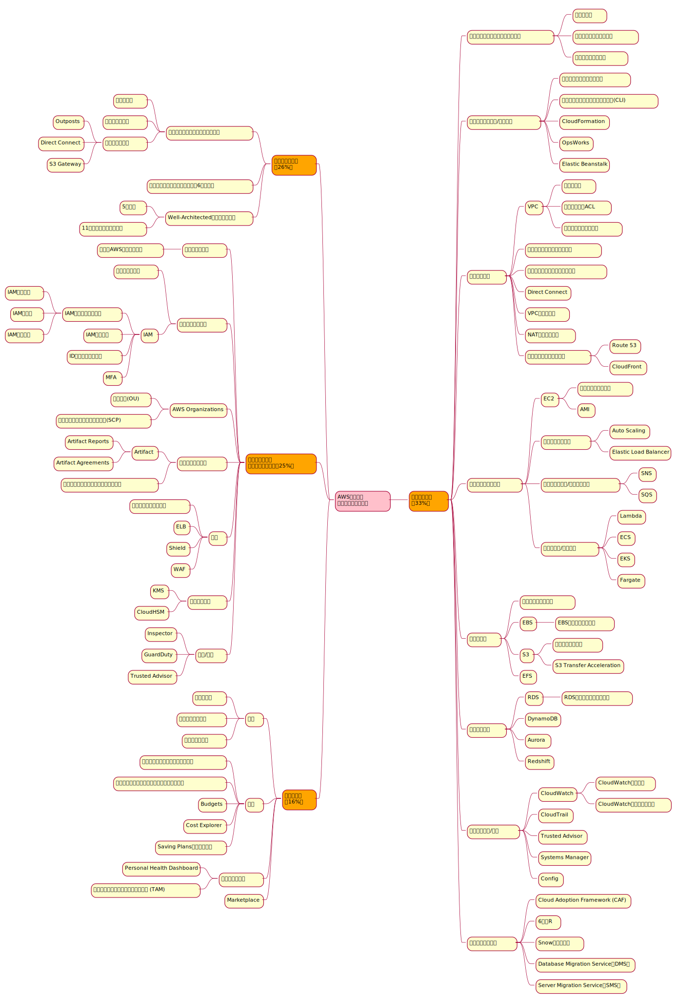

# クラウドプラクティショナー学習まとめ

<!-- @import "[TOC]" {cmd="toc" depthFrom=1 depthTo=6 orderedList=false} -->

<!-- code_chunk_output -->

- [クラウドプラクティショナー学習まとめ](#クラウドプラクティショナー学習まとめ)
- [1. 試験内容](#1-試験内容)
  - [試験の対象分野](#試験の対象分野)
  - [試験の詳細](#試験の詳細)
- [2. クラウドの概念](#2-クラウドの概念)
  - [クラウドコンピューティングとは](#クラウドコンピューティングとは)
  - [クラウドコンピューティングの6つの利点](#クラウドコンピューティングの6つの利点)
  - [Well-Architectedフレームワーク](#well-architectedフレームワーク)
    - [5つの柱](#5つの柱)
    - [11のベストプラクティス](#11のベストプラクティス)
- [3. セキュリティとコンプライアンス](#3-セキュリティとコンプライアンス)
  - [責任共有モデル](#責任共有モデル)
    - [責任範囲の考え方](#責任範囲の考え方)
  - [ユーザーアクセス](#ユーザーアクセス)
    - [ルートユーザー](#ルートユーザー)
    - [IAM](#iam)
  - [AWS Organizations](#aws-organizations)
    - [複数アカウントを一元管理](#複数アカウントを一元管理)
    - [組織単位（OU）](#組織単位ou)
    - [サービスコントロールポリシー（SCP）](#サービスコントロールポリシーscp)
  - [コンプライアンス](#コンプライアンス)
    - [AWS Artifact](#aws-artifact)
    - [カスタマーコンプライアンスセンター](#カスタマーコンプライアンスセンター)
    - [防御](#防御)
      - [セキュリティグループ](#セキュリティグループ)
    - [Elastic Load Balancer（ELB）](#elastic-load-balancerelb)
    - [AWS WAF（Web Application Firewall）](#aws-wafweb-application-firewall)
    - [AWS Shield](#aws-shield)
  - [データ暗号化](#データ暗号化)
    - [AWS KMS（Key Management System）](#aws-kmskey-management-system)
    - [CloudHSM](#cloudhsm)
  - [評価/分析](#評価分析)
    - [Inspector](#inspector)
    - [GuardDuty](#guardduty)
    - [Trusted Advisor](#trusted-advisor)
    - [AWS不正対策チーム（Trust & Safety Team）](#aws不正対策チームtrust-safety-team)
- [4. 請求と料金](#4-請求と料金)
  - [料金](#料金)
    - [無料利用枠](#無料利用枠)
    - [料金体系の仕組み](#料金体系の仕組み)
    - [料金計算ツール](#料金計算ツール)
  - [請求](#請求)
    - [請求とコスト管理ダッシュボード](#請求とコスト管理ダッシュボード)
    - [コンソリデーティッドビリング（一括請求）](#コンソリデーティッドビリング一括請求)
    - [AWS Budgets](#aws-budgets)
    - [AWS Cost Explorer](#aws-cost-explorer)
  - [AWSサポートプラン](#awsサポートプラン)
    - [テクニカルアカウントマネージャー（TAM）](#テクニカルアカウントマネージャーtam)
  - [AWS Marketplace](#aws-marketplace)
- [5. テクノロジー](#5-テクノロジー)
  - [グローバルインフラクトラクチャ](#グローバルインフラクトラクチャ)
    - [リージョン](#リージョン)
    - [アベイラビリティゾーン](#アベイラビリティゾーン)
    - [エッジロケーション](#エッジロケーション)
  - [プロビジョニング/デプロイ](#プロビジョニングデプロイ)
    - [AWSマネジメントコンソール](#awsマネジメントコンソール)
    - [AWSコマンドラインインターフェース（AWS CLI）](#awsコマンドラインインターフェースaws-cli)
    - [ソフトウェア開発キット（SDK）](#ソフトウェア開発キットsdk)
    - [CloudFormation](#cloudformation)
    - [OpsWorks](#opsworks)
    - [Elastic Beanstalk](#elastic-beanstalk)
  - [ネットワーク](#ネットワーク)
    - [VPC](#vpc)
    - [インターネットゲートウェイ](#インターネットゲートウェイ)
    - [仮想プライベートゲートウェイ](#仮想プライベートゲートウェイ)
    - [Direct Connect](#direct-connect)
    - [VPCピアリング](#vpcピアリング)
    - [VPCのネットワーク構成要素](#vpcのネットワーク構成要素)
      - [サブネット](#サブネット)
      - [ネットワークACL（アクセスコントロールリスト）](#ネットワークaclアクセスコントロールリスト)
      - [セキュリティグループ](#セキュリティグループ-1)
    - [コンテンツ配信サービス](#コンテンツ配信サービス)
      - [Route 53](#route-53)
      - [CloudFront](#cloudfront)
  - [コンピューティング](#コンピューティング)
    - [EC2](#ec2)
      - [EC2のインスタンスタイプ](#ec2のインスタンスタイプ)
      - [EC2の料金](#ec2の料金)
      - [AMI](#ami)
      - [プレイスメントグループ](#プレイスメントグループ)
  - [スケーラビリティ](#スケーラビリティ)
    - [Auto Scaling](#auto-scaling)
    - [Elastic Load Balancer（ELB）](#elastic-load-balancerelb-1)
    - [メッセージ/キューイング](#メッセージキューイング)
      - [Simple Notification Service（SNS）](#simple-notification-servicesns)
      - [Simple Queue Service（SQS）](#simple-queue-servicesqs)
  - [サーバーレス/コンテナ](#サーバーレスコンテナ)
    - [Lambda](#lambda)
    - [ECS（Elastic Container Service）](#ecselastic-container-service)
    - [EKS（Elastic Kubernetes Service）](#ekselastic-kubernetes-service)
    - [Fargate](#fargate)
    - [コンテナサービスでのAWS/ユーザーの責任範囲](#コンテナサービスでのawsユーザーの責任範囲)
  - [ストレージ](#ストレージ)
    - [インスタンスストア](#インスタンスストア)
    - [EBS](#ebs)
    - [EBSスナップショット](#ebsスナップショット)
    - [S3](#s3)
      - [S3のセキュリティ](#s3のセキュリティ)
      - [S3ストレージクラス](#s3ストレージクラス)
      - [S3 Transfer Acceleration](#s3-transfer-acceleration)
      - [S3ゲートウェイ](#s3ゲートウェイ)
    - [EFS](#efs)
  - [データベース](#データベース)
    - [RDS](#rds)
      - [RDSデータベースエンジン](#rdsデータベースエンジン)
    - [DynamoDB](#dynamodb)
      - [RDSとDynamoDBの違い](#rdsとdynamodbの違い)
    - [Redshift](#redshift)
    - [Database Migration Service（DMS）](#database-migration-servicedms)
    - [その他のデータベース](#その他のデータベース)
  - [モニタリング/運用](#モニタリング運用)
    - [CloudWatch](#cloudwatch)
      - [CloudWatchアラーム](#cloudwatchアラーム)
      - [CloudWatchダッシュボード](#cloudwatchダッシュボード)
    - [CloudTrail](#cloudtrail)
    - [Trusted Advisor](#trusted-advisor-1)
    - [Systems Manager](#systems-manager)
    - [Config](#config)
  - [マイグレーション](#マイグレーション)
    - [Cloud Adoption Framework（CAF）](#cloud-adoption-frameworkcaf)
    - [6つのR](#6つのr)
    - [Snowファミリー](#snowファミリー)
    - [Server Migration Service（SMS）](#server-migration-servicesms)
  - [その他のサービス](#その他のサービス)
    - [Amazon Elastic MapReduce（EMR）](#amazon-elastic-mapreduceemr)
    - [AWS Outposts](#aws-outposts)

<!-- /code_chunk_output -->

# 1. 試験内容
## 試験の対象分野

| 分野 | 試験の割合 |
|--|--|
| クラウドの概念 | 26% |
| セキュリティとコンプライアンス | 25% |
| 請求と料金 | 16% |
| テクノロジー | 33% |

試験の内容をマインドマップで整理

## 試験の詳細
* 問題数: **65問**
* 試験時間: **90分**
* 最低合格スコア: **70%**
* 試験には、多肢選択式と複数解答の2種類の問題がある
  * 多肢選択式の問題では、1つの正しい選択肢と3つの誤った選択肢 (不正解) が提示される
  * 複数解答の問題では、選択肢が5つ以上提示され、そのうち**2つ以上が正解**

# 2. クラウドの概念
## クラウドコンピューティングとは
3つのデプロイモデル

1. クラウドベースデプロイ
    * リソースをクラウドに展開
2. オンプレミスデプロイ
    * リソースをオンプレミスに展開
    * プライベートクラウドデプロイとも呼ばれる
3. ハイブリッドデプロイ
    * クラウドのリソースをオンプレミスのインフラに接続
    * レガシーアプリケーションをオンプレミスで運用しつつ、データ分析サービスをクラウドで実行する等

## クラウドコンピューティングの6つの利点
https://docs.aws.amazon.com/whitepapers/latest/aws-overview/six-advantages-of-cloud-computing.html

1. Trade capital expense for variable expense
    * 先行支出（設備投資費等の固定費）を変動支出に切り替える
2. Stop spending money running and maintaining data centers
    * データセンターやインフラ導入コスト、それらの運用保守への投資不要
3. Stop guessing capacity
    * キャパシティの予測が不要
    * 需要に応じて（**オンデマンド**に）キャパシティを追加/削減（**スケールアウト/スケールイン**）すればよい
4. Benefit from massive economies of scale
    * 数十万のユーザーによる圧倒的に高いスケールメリット
    * AWSにサービスを集約することで自社で構築するよりも変動コストを抑制可能
5. Increase speed and agility
    * スピードと俊敏性の向上
    * 新しいリソースの取得が数分で行える分、実験やイノベーションにかける時間を増やせる
6. Go global in minutes
    * AWSのグローバルインフラクトラクチャを利用することで、世界中に低レイテンシーでアプリケーションを展開

## Well-Architectedフレームワーク
https://aws.amazon.com/jp/architecture/well-architected/

* 信頼性、安全性、効率が高く、コスト効率に優れたシステムを設計し、AWS クラウドで運用する方法を理解するのに役立つ
* ベストプラクティスに照らしてアーキテクチャを評価し、原則を設計し、改善すべき分野を特定する一貫した方法を提供
* 自分自身で確認するAWS Well-Architected Toolもある

### 5つの柱
1. 運用上の優秀性 (Operation Excellence) 
    * ビジネス価値実現のための継続的な改善プロセス構築
    * 例えば、デプロイパイプラインの構築等
2. 安全性 (Security) 
    * ビジネス価値を提供しながら、情報・システム・資産を保護する能力
    * 具体的には、データの整合性・暗号化等の機能
3. 信頼性 (Reliability) 
    * 自動スケーリングや自動プロビジョニングなど、柔軟で弾力性のあるシステム
    * システムの早期の自動障害復旧・高可用性等、一貫したワークロードの実現
4. パフォーマンス効率 (Performance Efficiency) 
    * システム要件を満たす効率的なコンピューティングリソース配分・維持
    * 具体的には、サーバレスアーキテクチャ、グローバルなデプロイ
5. コスト最適化 (Cost Optimization) 
    * 最も安価にシステムを実行してビジネス価値を実現
    * 具体的には、マネージドサービス適用によるコスト効率化

### 11のベストプラクティス
5つの柱の具体例は **ベストプラクティス**として公開されており、
AWSホワイトペーパー等により確認・学習が可能

| | 項目 | 内容 | 関連サービス |
|--|--|--|--|
| 1 | スケーラビリティの確保 | 需要の変化に対応できるアーキテクチャを設計 | Auto Scaling、CloudWatch、RDS、DynamoDB |
| 2 | 環境の自動化 | システムの安定性・整合性及び組織の効率性を改善するため主要プロセスを自動化する | CloudFormation、Codeシリーズ、ElasticBeanstalk、OpsWorks、ECS |
| 3 | 使い捨てリソースの使用 | サーバーなどのコンポーネントを一時的なリソースとして利用・設計 | EC2、Auto Scaling |
| 4 | コンポーネントの疎結合 | コンポーネント間の相互依存を減らした構成とし、１つのコンポーネント変更や障害の影響を削減 | ELB、SNS、SQS |
| 5 | サーバレス | マネージド型サービスとサーバレスアーキテクチャにより、効率的な設計と運用を実現 | マネージド型サービス全般 |
| 6 | 最適なデータベース選択 | ワークロードに応じた最適なデータベース技術を利用 | RDS、Aurora、Redshift、DynamoDB、ElasticSearch |
| 7 | 増大するデータ量対応 | IoT/ビッグデータなどで絶えず増加するデータの保持を効率的に実施する | S3、Glacier、Kinesis |
| 8 | 単一障害点(SPOF)の排除 | AWSのサービスの多くは高可用が保証されているものが多いが、そうでないものはELBやマルチAZによる高可用設計が必要 | |
| 9 | コスト最適化 | リソースが適切なサイズから必要に応じたスケールアウト・スケールインの実施と最適な料金プランの選択する | EC2購入プラン、Auto Scaling、Trusted Advisor |
| 10 | キャッシュの利用 | 繰り返し取り出すデータやコンテンツについてはキャッシュを利用する構成とする | CloudFront、ElastiCache |
| 11 | セキュリティの確保 | 全てのレイヤー・境界・リソース内/間においてセキュリティを実装する | ほぼすべてのリソース |

5つの柱と11のベストプラクティスの関係性

# 3. セキュリティとコンプライアンス
## 責任共有モデル

* AWSはユーザー（顧客）の環境を「相互に関連づけられ構築されているパーツの集合」として扱う
* 責任共有モデル：AWSはユーザーの環境の一部に責任を持ち、その他の部分はユーザーが責任を持つ

### 責任範囲の考え方
| 項目 | 責任範囲 | 内容 |
|--|--|--|
| 物理的なセキュリティ | AWS | 1. 環境レイヤー：自然災害等の環境リスクの軽減 2. 物理的な境界防御レイヤー：保安要員、防御壁、監視カメラ等の物理設備の設置 3. 物理的なインフラレイヤー：発電設備、冷暖房設備、消化設備等の設置 4. データレイヤー：アクセス制限、脅威検出、ネットワークトラフィック保護、インフラのパッチ適用
| ハイパーバイザーのセキュリティ | AWS | VMエスケープやVMホッピング等のハイパーバイザーをターゲットにした攻撃 準仮想化(PV)インスタンスについても最新のAMIや更新パッケージを提供 |
| マネージドサービスのセキュリティ | AWS | PaaSやSaaSに該当するサービスのセキュリティ対応 |
| 管理プレーン | ユーザー | IDとパスワード キーペア アクセスキー IAM等のアクセス制御と権限管理 |
| 非マネージドサービスのセキュリティ | ユーザー | IaaS（VPC,EC2）等はユーザーが必要なセキュリティ設定と管理タスクを実施 [※1] そこに配置するデータやコンテンツの管理もユーザーの責任 |

* 具体例が https://qiita.com/taktak813tec/items/2299ce34070af2eb3f6a にまとまっている
* [※1] EC2インスタンスのペネトレーションテスト等はユーザーがAWSからの許可なし行ってよい

## ユーザーアクセス
### ルートユーザー
* サインアップ時に作成したアカウント
* AWSアカウントの全ての権限を持っている
* 日常的な作業にはこれを使わずIAMユーザーを作成して利用する

### IAM
* IAMアイデンティティ
  * IAMユーザー
  * IAMロール
  * IAMグループ
* IAMポリシー
  * IAMアイデンティティに割り当てる権限を記述したJSONドキュメント
    * `Effect`: 許可/禁止を記述
    * `Action`: 操作のコマンドを記述
    * `Resource`: 操作の対象リソースを記述
* アクセスキー
  * IAMユーザーに対する長期的な認証情報。アクセスキーID・シークレットアクセスキーで構成
  * このキー認証を通すことで、IAMユーザーの権限でAWSリソースに対する操作を実行可能
* IDフェデレーション
  * 外部で管理されたIDで認証してAWSサービスの使用許可を制御
* MFA（多要素認証）
  * ID、パスワードに加えて、専用デバイス/仮想デバイスに表示されるランダムなコードによる認証方式

## AWS Organizations
### 複数アカウントを一元管理
その企業が複数のアカウントを持っている場合、AWS Organizationsを使用すると、それらのアカウント群をー元的に管理することができる

### 組織単位（OU）

管理しているアカウントのうちの複数を組織単位（OU：Organization Unit）にグループ化できる

### サービスコントロールポリシー（SCP）
OUまたは個別アカウントに指定するポリシーで、OU／アカウントで実行できるサービスやアクションを制限できる

## コンプライアンス
### AWS Artifact
* https://aws.amazon.com/jp/artifact/
* セキュリティおよびコンプライアンスレポートと特定のオンライン契約にオンデマンドにアクセスできる

| サービス | 内容 |
|--|--|
| AWS Artifact Reports | サードパーティーの監査人が世界、地域、業界の指定された基準や規制を遵守しテストおよび確認したコンプライアンスレポートを提供 |
| AWS Artifact Agreements | ユーザーのアカウントとAWSとの契約の確認、受諾、管理が行えるサービス 扱える契約の種類は多岐にわたり、医療保険の相互運用性と説明責任に関する法令（HIPAA）など、特定の規制の対象となる顧客のニーズにも対応 |

### カスタマーコンプライアンスセンター
* https://aws.amazon.com/jp/compliance/customer-center/
* AWSのコンプライアンス、統制、監査の詳細を確認するためのリソースを提供

### 防御

> * https://pages.awscloud.com/rs/112-TZM-766/images/B2-08.pdf
> * CloudFrontもIPレンジのホワイトリスト設定のようにセキュリティ防御で使える要素もある

#### セキュリティグループ
* リソースへの適切なリクエストトラフィックのみを許可するサービス
* セキュリティグループはインスタンスレベルではなくネットワークレベルで動作する
* UDPフラッドやUDPリフレクションのような低レベルネットワークの攻撃に対して、ネットワーク（AWSインフラ）レベルで対処できるため、ユーザーのアプリケーションが攻撃に対して直接的に被害を受けず極めて有効に働く

### Elastic Load Balancer（ELB）
* 機能の詳細は「コンピューティング」を参照
* AWSのリージョン単位で機能するため、SlowlorisのようにHTTPトラフィックのリクエストを遅延・飽和させるような攻撃について、ELBを配置することで攻撃者はリージョンレベルで飽和させる必要があり極めてコストがかかることから、これらの攻撃に対して有効に働く

### AWS WAF（Web Application Firewall）
* CloudFrontやALBと連動してウェブアプリケーションに入ってくるネットワークリクエストをモニタリングするウェブアプリケーションファイアウォール
* WAFの定義（ウェブACL）はユーザー自身で行う必要があるが、SQLインジェクションやXSSのような一般的な攻撃をブロックするカスタムルールが用意されており、特定のアプリケーションのための独自ルールを作成することも可能

### AWS Shield
DDoS攻撃からアプリケーションを保護するサービス

| サービス | 有償/無償 | 内容 |
|--|--|--|
| AWS Shield Standard | 無償 | 最も一般的で頻度の高いタイプのDDoS攻撃からAWSリソースを保護 |
| AWS Shield Advanced | 有償 | ・詳細な攻撃診断と、高度なDDoS攻撃の検出および緩和機能を持つ ・CloudFront、Route 53、Elastic Load Balancing などの他のサービスと統合されている ・複雑なDDoS攻撃を緩和するカスタムルールを作成して、AWS WAFと統合することができる。また、WAFサービスが無制限に利用可能になる ・DDoS Response Team（DRT）のフォレンジックや分析サポートを24時間365日受けることができる |

## データ暗号化
### AWS KMS（Key Management System）
* AWSリソースに対して暗号化キーによる暗号化オペレーションを実行できるサービス
* CMK（カスタマーマスターキー）そのものはAWS管理のサーバで管理しそれを利用
* 独自のキーマテリアルをKMSにインポートできる
* CloudTrailと統合されており、すべての暗号化キーの使用履歴ログを確認可能
* https://dev.classmethod.jp/articles/10minutes-kms/ の説明が詳しい

### CloudHSM
* AWSが提供するクラウドベースのハードウェアセキュリティモジュール（HSM）
* CloudHSMクラスタはユーザー専用（KMSの場合は共有サーバ）のため、VPC内にクラスタを作成する必要がある
* PKCS#11、Java Cyrptography Extensions（JCE）、Microsoft CryptNG（CNG）といったグローバル標準の暗号化形式に対応
* 暗号化キーを他のHSMソリューションに移行することも可能（標準の暗号化形式のため？）
* KMSよりより厳しいコンプライアンス基準に対応できると思われる

## 評価/分析
### Inspector
* アプリケーション脆弱性診断等のセキュリティ評価を自動で行うサービス
* PCI DSSのようなルールパッケージを利用してスケジュール設定により自動でチェック。例えばEC2インスタンスの脆弱性やセキュリティのベストプラクティスの逸脱を検出
* 生成されたコンプライアンスレポートはAWS Artifactから取得可能

### GuardDuty
* AWSインフラストラクチャとリソースに対しインテリジェントな脅威検出を提供するサービス
* AWS環境内におけるネットワークとアカウントのアクティビティを継続的にモニタリングし脅威を特定
* また、AWS Lambda関数に対して、GuardDutyのセキュリティ調査結果に応じて自動修復を実行することもできる（修復対象のリソースはLambdaの他にもあるかも）

### Trusted Advisor
（モニタリング/運用の章を参照）

### AWS不正対策チーム（Trust & Safety Team）
* https://aws.amazon.com/jp/premiumsupport/knowledge-center/report-aws-abuse/
* AWSリソースが不正使用されている、または違法な目的で使用されている疑いがある場合にサポートを提供してくれる
* 不正対策チームの処理例は以下の通り

| 項目 | 内容 |
|--|--|
| スパム | AWS所有のIPアドレスから不要なメールが届く、またはAWSリソースがスパムウェブサイトやフォーラムに使用されている |
| ポートスキャニング | ログに、1つ以上のAWS所有のIPアドレスがサーバー上の複数のポートにパケットを送信していることが示されており、セキュリティで保護されていないポートを検出しようとしていると考えられる |
| サービス拒否攻撃 (DOS) | ログに、1つ以上のAWS所有のIPアドレスがリソースのポートをパケットで溢れさせるために使用されていることが示されている |
| 侵入の試み | ログに、1つ以上のAWS所有のIPアドレスがリソースへのログイン試行に使用されていることが示されている |
| 不快なコンテンツや 著作権で保護された コンテンツのホスティング | AWSリソースが著作権者の同意なしに、違法コンテンツをホストまたは配布している |
| マルウェア配信 | インストール先のコンピュータやマシンに不正アクセスしたり危害を加えるために意図的に作成されたソフトウェアを配布するために、AWSリソースが使用されている証拠がある |

# 4. 請求と料金
## 料金
### 無料利用枠
* AWS無料利用枠を使用すると、一定期間料金が発生することを心配せずに、特定のサービスの使用を開始できる
* 用意されているオファーは以下の3種

| 利用枠 | 開始 | 対象サービス | 内容 |
|--|--|--|--|
| 無期限無料 | 無期限 | Lambda | 毎月100万件の無料リクエストと最大320万秒のコンピューティング時間が無料 |
| | | DynamoDB | 毎月25GBのストレージが無料 |
| 12か月間無料 | サインアップした日から | EC2 | 特定のインスタンスタイプのEC2インスタンス |
| | | S3 | 特定量のS3標準ストレージ |
| | | CloudFront | 特定量のデータ送信 |
| トライアル | そのサービスを有効化した日から | Inspector | 90日間の無料トライアル |
| | | Lightsail | 30日間750時間までの無料トライアル |

### 料金体系の仕組み
幅広いクラウドコンピューティングサービスを従量課金性で提供

* 使用分についてのみ課金される
  * 各サービスにおいて実際に使ったリソースの量に応じて料金を支払う
  * 長期の契約や複雑なライセンスは不要
* 予約して支払いを削減する
  * 一部のサービスでは、オンデマンドインスタンスと比べて大幅な割引を得られる予約オプション（Savings Plans）がある [※1]
* 使用料が増えるほど、ボリュームディスカウントにより支払いが少なくなる
  * 一部のサービスでは段階制料金が用意されており、使用量が増えるほど単位あたりのコストが低くなる
  * 例えばS3はストレージ容量の使用量が増えるほど、1GBあたりに支払う料金が少なくなる

> * [※1] EC2,Lambda,Fargateなど、1年または3年の長期利用に対して大幅なディスカウントがされる
>   * リザーブドインスタンス（RI)とは別の概念のため併用は可能（併用がその手間に見合うかは別問題でありそう）
>   * https://qiita.com/hayao_k/items/650a2131a96c8f20cb97

### 料金計算ツール
* AWS料金計算ツール
  * https://calculator.aws/#/
  * AWSのサービスを確認し、AWSユースケースのコスト見積もりを作成できる
* AWS簡易見積もりサービス
  * 事前に請求見込み金額を計算可能
  * **AWS料金計算ツールに置き換えられるため今後は使用されない**
* AWS TCO計算ツール
  * TCO: Total Cost of Ownership
  * AWSへの移行・導入を検討している際に、オンプレミス構築とのコスト比較をレポートしてくれる

## 請求
### 請求とコスト管理ダッシュボード
* 月別の請求額や内訳を確認できる
* 今月途中の利用や来月の請求額の予測を知ることができる
* 無料利用枠の使用状況を確認できる
* AWS Budgetsで予算を作成する（後述）
* Savings Plansの購入・管理を行う
* AWSのコストと使用状況レポート（CUR：Cost and Usage Report）を発行できる

### コンソリデーティッドビリング（一括請求）
* AWS Organizationsのオプションの１つで、組織内のすべてのアカウントの請求書を１つにまとめることができる
* １つにまとめることでボリュームディスカウント（合計使用量による割引）を受けれたり、Savings Plansやリザーブドインスタンスを組織内のアカウントで共有することができる

### AWS Budgets

* 予算を作成してサービスの使用量、コスト、インスタンスのリザーブを計画できる
* 毎日3回更新され、使用量が予算の量または無料利用枠の制限にどれくらい近づいているかを正確に確認できる
* 設定予算を超えた時にor超えると予想される場合に送信されるカスタムアラートを設定できる

### AWS Cost Explorer

* 時間の経過に伴うAWSのコストと使用量を可視化して把握し、管理できるツール
* これまでのAWSのコストを分析することで、今後のコストの予算の組み立て方について十分な情報にもとづく意思決定が行える

## AWSサポートプラン

| プラン | 料金 | 内容　|
|--|--|--|
| ベーシック | 無料 |・Trusted Advisorの一部を利用できる ・AWS Personal Health Dashboardを使用できる
| デベロッパー | 29USD 使用料の3% の大きい方 | ・Trusted Advisorの一部を利用できる ・ベストプラクティスのガイダンス ・クライアント側の診断ツール？ ・基盤となるアーキテクチャのサポート（9:00〜18:00） |
| ビジネス | 100USD 使用料に応じた計算式 の大きい方 | ・Trusted Advisorの全機能を利用できる ・技術サポート（24h可）・サードパーティソフトウェアの限定的なサポート |
| エンタープライズ | 15,000USD 使用料に応じた計算式 の大きい方 | ・Trusted Advisorの全機能を利用できる ・技術サポート（24h可） **・テクニカルアカウントマネージャー (TAM)** ・ホワイトグローブケースルーティング（問題をあげた時にAWSの各部署が連携して優先対応） ・Infrastructure Event Management（重要なビジネスイベントに向けてのアーキテクチャとスケーリングのガイダンスと運用サポート） |

> 実ビジネスで利用する場合は、技術サポートを24時間受けれるビジネスorエンタープライズがおすすめらしい

### テクニカルアカウントマネージャー（TAM）
* AWSのすべてのサービスに関する専門的な知識を提供。複数のサービスを効率的に使用するソリューションを設計・提案
* エンタープライズサポートプランに加入している場合は、TAMがAWSの主要な窓口となる

## AWS Marketplace
* 独立系ソフトウェアベンダーから提供された多くのソフトウェアからなるデジタルカタログ
* AWSで実行できるソフトウェアのトライアルや購入が可能

# 5. テクノロジー
## グローバルインフラクトラクチャ
### リージョン
* 全世界に24のリージョン (2020/05現在)
* リージョン内に2つ以上のアベイラビリティゾーンが存在
* リージョンを決定する要素
  * データガバナンスと法令要件の遵守
  * ユーザーとの近接性
  * リージョン内で利用可能なサービス
  * 料金
* マルチサイトアクティブ-アクティブ
  * 複数リージョンに完全に稼働する同一システムを構築
  * 大規模災害時のダウンタイムの最小化

### アベイラビリティゾーン
* アベイラビリティゾーン（AZ）：リージョン内の1つないし複数のデータセンターで構成
* AZは数十マイル以内の離れた位置に存在。これはAZ間の低レイテンシーの通信を実現するため

> アプリケーションを複数のAZにデプロイすることは、耐障害性と可用性に優れたアーキテクチャを構築する上で重要な要素となる

### エッジロケーション
* エッジロケーション：「コンテンツの低レイテンシー配信」「低レイテンシーなDNSクエリ」を実現するために使用する場所
  * CloudFront: エッジロケーションで利用されるCDN（Contents Delivery Network）サービス。リクエストしたユーザーの近くに存在しキャッシュデータを返す
  * Route 53: エッジロケーションで利用されるDNSサービス
* リージョンよりもさらに細かく、全世界に42カ国84箇所に200以上存在

## プロビジョニング/デプロイ
### AWSマネジメントコンソール
AWSサービスにアクセスしサービスを管理するためのウェブベースのインターフェース

### AWSコマンドラインインターフェース（AWS CLI）
* ターミナル等のツール内のコマンドラインから直接AWSのサービスを制御できるインターフェース
* AWS CLIを使用することにより、サービスやアプリケーションに対するアクションをスクリプトで自動化できる

### ソフトウェア開発キット（SDK）
* プログラミング言語やプラットフォーム用に設計されたAPI群
* アプリケーションはこれらのAPIを介してAWSのサービスを使用できる

### CloudFormation
* AWSの各リソースによるインフラ構成をコード（JSON/YAML）によって自動作成/更新/管理する（IaC：Infrastructure as Code）
* インフラ構成をコードで記述できるため、安全で繰り返し可能な方法でリソースをプロビジョニングできる
* スタック（CloudFormationにおけるテンプレートで定義されたリソースの集合）を生成時にエラーが発生した場合、その変更が自動的にロールバックされる

### OpsWorks
* ChefやPuppetを利用してクラウドアプリケーションを設定・運用するための設定管理サービス
* CloudFormationはAWS全般の管理に対し、OpsWorksは主にEC2インスタンス上のアプリケーションの管理

### Elastic Beanstalk
* クラウドアプリケーションを迅速にデプロイするサービス
* キャパシティの調整、負荷分散、自動スケーリング、アプリケーション状態のモニタリングが可能
* Go、Java、.NET、Node.js、PHP、Python、Ruby で開発されたアプリケーションをサポート

## ネットワーク
### VPC
* VPC: Vitual Private Cloud
* AWSリソースに対する境界を確立するために使用できるネットワークサービス
* CIDRでIPアドレスの範囲を定義 (ex `10.0.0.0/16`)
* 複数のAZにまたがることが可能

### インターネットゲートウェイ
* インターネットからのパブリックトラフィックをVPCに渡すためのゲートウェイ
* VPCにアタッチ。デフォルトで水平スケーリングされており単一障害点(SPOF)にならない
* パブリックサブネットに配置されたインスタンスにアクセスできる

### 仮想プライベートゲートウェイ
* インターネットからVPC内のプライベートリソースにアクセスするためのゲートウェイ
* オンプレミスとVPCの間にVPN（仮想プライベートネットワーク）接続を確立できる
* トラフィクは暗号化されるもののインターネットを経由してアクセスする

### Direct Connect
* オンプレミスとVPCの間に専用のプライベート接続を確立できる
* Direct Connectを使用すると、ネットワークコストを削減したり、ネットワークの帯域幅を増やすことが可能になる

### VPCピアリング
* 複数のVPC同士を接続する
* 同じアカウント・リージョンのVPC同士、同じアカウント・別のリージョンのVPC同士、別のアカウントのVPC同士とも接続が可能

### VPCのネットワーク構成要素

#### サブネット
* セキュリティ・運用のニーズにもとづいてリソースをグループ化できるVPC内のセクション
* パブリックサブネット
  * パブリックに公開されているリソースが含まれる
  * インターネットゲートウェイに対しての経路を持つルートテーブルに関連付けられる
* プライベートサブネット
  * プライベートネットワークを介してのみアクセス可能なリソースが含まれる
  * プライベートサブネットからインターネットに接続するためには、パブリックサブネットに**NATゲートウェイ**を設置する
* VPC内ではサブネットは相互に通信できる
* ルートテーブル
  * サブネットの経路を定義。サブネット毎に設定が必要

#### ネットワークACL（アクセスコントロールリスト）
* サブネット単位でインバウンド/アウトバウンドトラフィックを制御する仮想ファイアウォール
* 各アカウントにはデフォルトのネットワークACLがあり、VPCを作成する際はデフォルトのネットワークACL or カスタムのネットワークACLを使用できる
  * デフォルトのネットワークACLは、**すべてのインバウンド/アウトバウンドトラフィックを許可する**
* ステートレスパケットフィルタリング
  * パケットはサブネットの境界（インバウンドとアウトバウンドの双方向）を出入りするたびにチェックされる

#### セキュリティグループ
* リソース単位でインバウンド/アウトバウンドのトラフィックを制御する仮想ファイアウォール
* デフォルトでは、**すべてのインバウンドトラフィックを拒否、すべてのアウトバウンドトラフィックを許可する**
* ステートフルパケットフィルタリング
  * 受信パケットに対して行われた以前の処理情報が保存される
  * 例えば、あるインスタンスから送信したリクエストに対するレスポンスがインスタンスに返される時、セキュリティグループはインバウンドルールに関係なくレスポンスの通信を通過させる

### コンテンツ配信サービス

#### Route 53
* AWSでホスティングできるDNSウェブサービス
* エッジロケーションに配置され、デフォルトで高可用性・スケーラブル
* 大きく2つの機能を持ち、ひとつはドメイン名のルーティング（ELBやEC2、AWS外のインフラも可能）、もうひとつはドメイン名の取得・登録などDNSレコードを管理

#### CloudFront
* AWSが提供するコンテンツ配信サービス（CDN）
* エッジロケーショに配置され、ユーザーに対し低レイテンシーでのコンテンツ配信が可能に

## コンピューティング
### EC2
* EC2: サイズ変更可能で安全な仮想サーバ（インスタンス）を提供
  * 数分以内にプロビジョニング
  * インスタンスの稼働時間で料金が発生
  * 必要なサーバ容量に対してのみコストを支払えるので節約可能

#### EC2のインスタンスタイプ
| インスタンスタイプ | 内容　|
|--|--|
| 汎用 |・コンピューティング、メモリ、ネットワークのリソースをバランスよく提供 ・ワークロード：アプリケーションサーバ、ゲームサーバ、バックエンドサーバ、小中規模のデータベース |
| コンピューティング最適化 |・高パフォーマンスプロセッサの恩恵を受けることができる ・ワークロード：計算負荷が高いアプリケーションサーバ、専用のゲームサーバ、バッチ処理 |
| メモリ最適化 |・メモリ内にロードした大規模なデータセットの処理に適している ・ワークロード：高パフォーマンスなデータベース、大量の非構造化データのリアルタイム処理 |
| 高速コンピューティング |・ハードウェアアクセラレータやコプロセッサにより浮動小数点演算やグラフィックス処理等の機能を効率的に実行 ・ワークロード：グラフィックアプリケーション、ゲームストリーミング |
| ストレージ最適化 |・ローカルストレージに大規模なデータセットの読み書きアクセスに適している ・ワークロード：分散ファイルシステム、データウェアハウス、高頻度のOLTPシステム |

#### EC2の料金

| 料金オプション | 期間 | 内容 |
|--|--|--|
| オンデマンド | - | 定価料金。不規則で短期的なワークロードに最適 |
| Saving Plans | 1年/3年 |・一定のコンピューティング使用量を期間で契約 ・契約した使用量に達するまではSavings Plan料金（例えば10USD/h。超えた分はオンデマンドインスタンス）で課金される |
| リザーブド インスタンス （スタンダード/ コンバーティブル） | 1年/3年 |オンデマンドインスタンスに適用される割引プラン ・スタンダード：インスタンスタイプが固定。割引率が大きい ・コンバーティブル：スタンダードと比べて割引率は少ないが、期間中のインスタンスタイプの変更が可能 |
| リザーブド インスタンス （スケジュールド） | 1年 | オンデマンドインスタンスに適用される割引プラン 「金曜日のみ」「10時〜17時だけ」といった定期的な期間に限って利用 |
| スポット インスタンス | - | AWSのキャパシティの利用状況に応じて価格が変動。価格を見ながら運用できればコスト削減が見込める |
| Dedicated Hosts | - | ユーザー専用のEC2インスタンスキャパシティを備えた物理サーバが提供される。EC2の料金オプションで最も高価。セキュリティ/ガバナンス要件、ライセンス要件等を満たす目的で使用。(dedicated：専用の、献身的な) |
| ハードウェア専有インスタンス | - | ユーザー（アカウント）の専用ハードウェアのVPC内でインスタンスを実行 |

#### AMI
* EC2インスタンスを構成する管理情報
* AMIを作成する際は、この管理情報とEBSスナップショットがセットで作成される
* AMI（管理情報そのもの）は課金されない

#### プレイスメントグループ
* インスタンス間の通信速度を高速化させる機能（ネットワークのレイテンシーを削減する機能）
* 単一AZ内の複数のEC2インスタンスをグループ化し、物理的になるべく近いインスタンスとして起動
* 複数のAZを跨ぐグルーピングやネットワーク帯域が小さいインスタンスタイプはグループ化できない

## スケーラビリティ
### Auto Scaling
* アプリケーションの需要の変化に応じてEC2インスタンスを自動的に作成（スケールアウト）または削除（スケールイン）することができる
* 動的スケーリング/予測スケーリングの2つの方法が用意されている
  * 動的スケーリング：変化する需要に対応
  * 予測スケーリング：予測された需要にもとづき適切なキャパシティを用意
* キャパシティの設定

| パラメータ | 内容 |
|--|--|
| 最小キャパシティ | Auto Scalingグループ作成後にすぐ作成されるEC2インスタンスの数 |
| 希望キャパシティ | 定常時に作成されるEC2インスタンスの数 |
| 最大キャパシティ | 需要の増加に応じてスケールアウトする時のEC2インスタンス数の上限 タイミングや条件はAuto Scalingポリシーで設定 |

* Auto Scalingポリシーの詳細
  * ターゲットポリシー：CPU率等の数値にもとづき設定
  * シンプルポリシー：CloudWatchアラームにもとづき設定
  * ステップポリシー：複数フェーズでの設定

### Elastic Load Balancer（ELB）
* アプリケーションのトラフィックをEC2インスタンス等のリソースに自動的に分散するサービス
* ELBとAuto Scalingを連動させる（=Auto ScalingグループにELBのターゲットグループを設定する）ことにより、実行中のアプリケーションの高いスケーラビリティと可用性を実現できる

### メッセージ/キューイング
* モノリスからマイクロサービス
  * システムを疎結合にして、非同期APIでコンポーネント間を相互作用させる
  * 1つのコンポーネントで障害が発生しても、アプリケーションの可用性を維持すことができる（可能性がある）

#### Simple Notification Service（SNS）
* マネージド型のPub/Subメッセージサービス
* パブリッシャーはSNSトピックを発行、サブスクライバーはそれを受領（push方式。1対多のメッセージングが可能）

#### Simple Queue Service（SQS）
* マネージド型のメッセージキューイングサービス
* 送信されたメッセージはキューに保存される（受信側が消すまで消えない）
* 受信側はポーリング方式によりメッセージを受け取る（pull方式。1対1のメッセージングが可能）

## サーバーレス/コンテナ
* サーバレス：インスタンスのプロビジョニングや管理が不要（必要なのはコードのアップロード）
* コンテナ：アプリケーションのコードや依存関係を１つのオブジェクトにパッケージ化する技術。1台のホストで複数のコンテナを実行可能

### Lambda
* Lambda：サーバーレスでコードを実行できるコンピューティングサービス
* 使用したコンピューティング時間に対してのみ料金が発生

### ECS（Elastic Container Service）
* Amazon独自のコンテナ・オーケストレーション・サービス
  * プロビジョニングの操作や管理
  * ネットワークのトラフィック制御の設定や管理
* Docker Community Edition と Enterprise Editionyy両方をサポート

### EKS（Elastic Kubernetes Service）
* AWSでKubernetesを実行できるフルマネージドサービス
* Kubernetes：コンテナ化されたアプリケーションを大規模にデプロイして管理できるオープンソースソフトウェアです

### Fargate
* コンテナ向けのサーバーレスコンピューティングエンジン
* サーバーインフラはAWSによって管理されるため、ユーザーがサーバのプロビジョニングや管理を行う必要がない
* ECSとEKSの両方で利用可能
* 料金はコンテナの実行に必要なリソースに対してのみ発生

### コンテナサービスでのAWS/ユーザーの責任範囲
* AWS
  * インフラ管理
  * アプリケーションプラットフォームの管理
* ユーザー
  * プロビジョニング管理
  * アクセス管理
  * ネットワークトラフィック制御

## ストレージ
### インスタンスストア
* EC2インスタンスが起動している間のみデータを保持する、EC2内部の一時的なローカルストレージ
* EBSとは異なりネットワーク経由ではなく物理的に接続されている。そのためEC2が削除されると同時に削除される
* インスタンスストアそのものには課金されない

### EBS
* EC2インスタンスで使用できるブロックレベルのストレージボリュームを提供
* EC2インスタンスが停止または削除されても、アタッチされたEBSボリュームのすべてのデータは継続利用できる
* 単ーのAZのみデータを保存するため、冗長化する場合はユーザー側の設定が必要（Auto ScalingでEC2とまとめて冗長化するのが一般的か？）

### EBSスナップショット
* EBSボリュームのある時点のバックアップ
* 最初は完全バックアップ、その後は増分バックアップを行う
* EBSスナップショットの実体はS3（よってリージョン単位）で保存される

### S3
* オブジェクトレベルのストレージを提供するサービス
* データをオブジェクトとしてバケットに保存
  * バケットあたりの容量は無制限
  * オブジェクトのサイズは最大5TB
* オブジェクト単位で複数のAZにデータを保存
* オブジェクト単位・バケット単位で、可視性とアクセス制御を設定できる
* バージョニング機能により、オブジェクトの経時的な変更を追跡することも可能

> S3はブロックストレージではないので（=ブロック単位の編集はできずオブジェクトを全置き換えするしかないので）、頻繁で細かい修正を繰り返す場合はEBSの方が向いている

#### S3のセキュリティ
* 保存データの保護
  * データの暗号化を有効にする
* データ転送の保護
  * 転送時にSSLを使用 or クライアント側で暗号化してデータ転送

#### S3ストレージクラス

| クラス | 用途 | 特徴 |
|--|--|--|
| 標準 （Standard） | 頻繁にアクセスされるデータ |・最低3つのAZにデータを保存 ・コストは割高 |
| 標準IA （Standard IA） | アクセス頻度の低いが すぐ使用できるデータ |・標準に似ているが、ストレージ料金が低く取り出し料金が高い ・最低3つのAZにデータを保存 ・標準と同じレベルの可用性を提供 |
| 1ゾーンIA  （One-Zone-IA） | コストを節約かつ 障害発生時にデータを 簡単に復元可能 |・データを1つのAZに保存 ・その分料金が安価 |
| Intelligent-Tiering | アクセスパターンが不明 または変化するデータ |・オブジェクトのアクセスパターンをモニタリング ・30日間連続してアクセスがないオブジェクトは、自動的に低頻度アクセス階層である標準IAに移動 ・低頻度アクセス階層のオブジェクトにアクセスがあると、自動的に高頻度アクセス階層である標準に移動
| Glacier | データアーカイブ |・料金は標準/標準IA/1ゾーンIAに比べて安価 ・オブジェクトの取得が遅く数分〜数時間 |
| Glacier Deep Archive | データアーカイブ |・料金が最も安いクラス ・オブジェクトの取得が12時間以内 |

#### S3 Transfer Acceleration
エッジロケーションを利用し、クライアントとS3バケットの間で
長距離にわたるファイル転送を高速・簡単・安全に行えるサービス

#### S3ゲートウェイ
* オンプレミスにあるデータをクラウドに連携するためのインターフェースを提供するサービス
* 例えばオンプレミスに配置されたS3ゲートウェイからDirect Connectを経由してS3やGlacierにアクセス可能となる

### EFS
* AWSサービスおよびオンプレミスのリソースで使用できるスケーラブルなファイルシステム
* ファイルを追加または削除すると、EFSは自動的に拡張および縮小される
* アプリケーションを中断することなく、オンデマンドでペタバイト規模までスケール
* 複数のAZにデータを保存
* オンプレミスサーバーはDirect Connectを経由してEFににアクセス

## データベース
### RDS
* リレーショナルデータベースを実行するマネージド型のサービス
* ハードウェアのプロビジョニング、データベースのセットアップ、パッチ適用、バックアップなどのタスクを自動化
* 様々なセキュリティオプションを用意
  * 保管時の暗号化 (保存中のデータ保護) 
  * 転送時の暗号化 (送受信中のデータ保護) 

#### RDSデータベースエンジン
すべてSQL互換のデータベースエンジン
* Amazon Aurora
  * MySQLおよびPostreSQLとの互換性
  * 標準のMySQLよりも最大5倍、PostgreSQLよりも最大3倍高速
  * マルチAZを採用することで自動フェイルオーバー可能 
  * 手動でリードレプリカがマスターに昇格可能
  * **リードレプリカは最大15個作成可能**
  * ストレージ容量が自動的に増加
* PostgreSQL
* MySQL
* MariaDB
* Oracle DB
* Microsoft SQL Server

### DynamoDB
* サーバレスのキーバリューデータベースサービス
  * プロビジョニング、パッチ適用、管理等が不要
  * 自動的にスケーリング
* DynamoDB Accelerator（DAX）
  * インメモリキャッシュを利用しクエリを高速化（ms→usオーダー）
* DynamoDB Streams
  * データベースにたいする追加、変更、削除を検知できるサービス
  * クロスリージョン・レプリケーションでは有効化が必須

#### RDSとDynamoDBの違い

| 項目 | RDS | DynamoDB |
|--|--|--|
| タイプ | リレーショナル | 非リレショーナル |
| データ構造 | SQL | KVS |
| サービス形態 | マネージド | サーバレス |
| スケーリング | 垂直スケーリング | 水平スケーリング |
| トランザクション | ACIDを順守 | 結果整合性を保証 |
| アクセス性能 | 大量のアクセスは不向き | 大量のアクセスでも性能維持 |

### Redshift
* マネージド型のデータウェアハウジング（DWH）サービス
* 多くのソースからデータを収集し、データ全体の関係性や傾向を理解するのに役立つ機能を提供

### Database Migration Service（DMS）
* リレーショナルデータベース、非リレーショナルデータベース、およびその他のタイプのデータストアを移行できるサービス
* 移行元と移行先が異なるデータベース間でも利用可能。さらに、移行元のDBは移行中でも利用可能なためダウンタイムを低減

### その他のデータベース
* Amazon ElastiCache
  * インメモリ・データストアサービス
  * RedisとMemcachedのマネージドサービスとして使用可能
  * 具体的な用途：アプリケーションのセッション情報、DBのクエリ結果のキャッシュ
* Amazon Napture
  * グラフデータベースサービス
  * 関係性や相関情報を扱い、SNS・レコメンデーション(提案)エンジン・経路案内・物流最適化などの洗練されたグラフアプリケーションで活用できる
* DocumentDB
  * MongoDBワークロードをサポートするドキュメントデータベースサービス
* Quantum Ledger Database（QLDB）
  * 台帳データベースサービス
* Managed Blockchain
 * オープンソースフレームワークのブロックチェーンネットワークを作成および管理

## モニタリング/運用
### CloudWatch
様々なメトリクスをリアルタイムでモニタリングおよび管理し、
それらのメトリクスに基づいてアラームアクションを設定することが可能なサービス

#### CloudWatchアラーム
メトリクスの値が事前に定義した閾値を上回った/下回った場合に、自動的にアクションを実行するアラーム

#### CloudWatchダッシュボード
リソースのすべてのメトリクスにアクセスためのダッシュボード

### CloudTrail
* アカウントのAPIコールを記録しそれらをもとにユーザーのアクティビティやAPIリクエストを追跡可能なサービス
* また、ログをフィルタリングして、運用分析とトラブルシューティングに活用できる
* CloudTrail Insights：CloudTrailのオプションで、アカウントの異常なAPIアクティビティを自動的に検出できる

### Trusted Advisor
* AWS環境を検査し、AWSのベストプラクティスに基づいてリアルタイムの推奨事項を提供するサービス
* 評価する5つのカテゴリ
  * コスト最適化
  * パフォーマンス
  * セキュリティ
  * 耐障害性
  * サービスの制限

### Systems Manager
* 構築済みのインフラストラクチャを可視化し、制御するためのサービス
* 統一されたUIを介して複数のAWSサービスからの運用データを表示し、運用タスクを自動化することが可能

### Config
* AWSリソースの設定から、AWSリソースの構成情報のスナップショットを取得・管理
* この構成情報を元に、現状のAWSリソースの設定が、利用者によって定義された正しい状態になっているかを評価

## マイグレーション
### Cloud Adoption Framework（CAF）
* AWSへの移行プロセスを計画・管理するためのガイダンス
* 6つのパースペクティブから構成される

| パースペクティブ | ステークホルダー | 観点 |
|--|--|--|
| ビジネス | ビジネスマネージャー 財務マネージャー 予算担当者 戦略の関係者 | ・クラウド導入の強固なビジネスケースを作成し、クラウド導入イニシアチブに優先順位を付け ・ビジネスの戦略と目標がITの戦略と目標に一致していることを確認 |
| 人員 | 人事 人員配置 人材マネージャー | 人的な側面を使用して組織の構造と役割、新しいスキルとプロセスの要件を評価しギャップを特定する |
| ガバナンス | 最高情報責任者 (CIO) プログラムマネージャー エンタープライズアーキテクト ビジネスアナリスト ポートフォリオマネージャー |・クラウドでビジネスガバナンスを実現するために必要なスタッフのスキルとプロセスを新しくする方法を理解 ・クラウドへの投資を管理および測定しビジネスの成果を評価 |
| プラットフォーム | 最高技術責任者 (CTO) ITマネージャー ソリューションアーキテクト | ・さまざまなアーキテクチャモデルを使用して、IT システムの構造とその関係を理解し伝達 ・最終的に構築したい環境のアーキテクチャについて詳しく説明 |
| セキュリティ | 最高情報セキュリティ責任者 (CISO) ITセキュリティマネージャー ITセキュリティアナリスト | 組織のニーズ・目標（可視性、監査可能性、制御、俊敏性）を満たしたセキュリティコントロールの選択と導入を体系化 |
| オペレーション | ITオペレーションマネージャー ITサポートマネージャー | ビジネスの関係者の合意を得たレベルでITワークロードの復旧（=実現、実行、使用、運用）にフォーカスする |

### 6つのR

| 項目 | 内容 |
|--|--|
| リホスト （Lift & Shift） | アプリケーションの大部分を変更せず移行 |
| リプラットフォーム （Lift-Tinker-and-Shift） | アプリケーションの中核となるアーキテクチャを変更せずにクラウドに最適化 |
| リファクタリング | クラウドネイティブの機能を使用してアプリケーションのアーキテクチャの設計方法・開発方法を作り直す |
| 再購入 （Repurchase） | 従来のライセンスからSaaS (Software-as-a-Service) モデルに移行等 |
| 保持 （Retain） | 移行元の環境でビジネスに重要なアプリケーションを維持すること |
| リタイア | 不要になったアプリケーションを削除 |

### Snowファミリー

| デバイス/サービス | 内容 |
|--|--|
| Snowcone | 小型かつ堅牢で安全なエッジコンピューティングおよびデータ転送デバイス |
| Snowball Edge Storage Optimized | 大規模なデータ移行と定期的な転送のワークフローや、大容量を必要とするローカルコンピューティング
| Snowball Edge Compute Optimized | 機械学習、フルモーション動画分析、分析、ローカルコンピューティングスタックなどのユースケースに強力なコンピューティングリソースを提供 |
| Snowmobile | 大容量データをAWSに移動するために使用できるエクサバイト規模のデータ転送サービス セミトレーラートラックが牽引する長さ14mの丈夫な輸送コンテナで、Snowmobile 1台あたり最大100ペタバイトのデータを転送できる |

### Server Migration Service（SMS）
オンプレミスのワークロード（VMware vSphere、Microsoft Hyper-V/SCVMM、Azure仮想マシン）のAWSクラウドへの移行を自動化するサービス

## その他のサービス
### Amazon Elastic MapReduce（EMR）
* Apache Spark、Apache Hive、Presto などのオープンソースのビッグデータフレームワークを使用して、膨大な量のデータを処理して分析するサービス
* 主なユースケース
  * ETL処理
  * ストリーム分析
  * インタラクティブ分析
  * 機械学習、ゲノミクス

### AWS Outposts
* オンプレミスの形式を取りながら、AWSをクラウド型インフラストラクチャーとして実行できるサービス
* AWSが巨艦サーバを契約企業内に設置する
