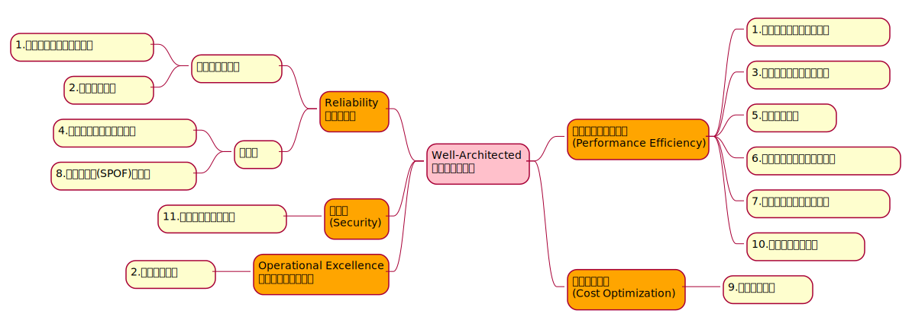

# クラウドプラクティショナー学習まとめ

## 1. 試験内容
### 試験の対象分野

| 分野 | 試験の割合 |
|--|--|
| クラウドの概念 | 26% |
| セキュリティとコンプライアンス | 25% |
| 請求と料金 | 16% |
| テクノロジー | 33% |

試験の内容をマインドマップで整理

### 試験の詳細
* 問題数: **65問**
* 試験時間: **90分**
* 最低合格スコア: **70%**
* 試験には、多肢選択式と複数解答の2種類の問題がある
  * 多肢選択式の問題では、1つの正しい選択肢と3つの誤った選択肢 (不正解) が提示される
  * 複数解答の問題では、選択肢が5つ以上提示され、そのうち**2つ以上が正解**

## クラウドの概念
### クラウドコンピューティングとは
3つのデプロイモデル

1. クラウドベースデプロイ
    * リソースをクラウドに展開
2. オンプレミスデプロイ
    * リソースをオンプレミスに展開
    * プライベートクラウドデプロイとも呼ばれる
3. ハイブリッドデプロイ
    * クラウドのリソースをオンプレミスのインフラに接続
    * レガシーアプリケーションをオンプレミスで運用しつつ、データ分析サービスをクラウドで実行する等

### 2. クラウドコンピューティングの6つの利点
https://docs.aws.amazon.com/whitepapers/latest/aws-overview/six-advantages-of-cloud-computing.html

1. Trade capital expense for variable expense
    * 先行支出（設備投資費等の固定費）を変動支出に切り替える
2. Stop spending money running and maintaining data centers
    * データセンターやインフラ導入コスト、それらの運用保守への投資不要
3. Stop guessing capacity
    * キャパシティの予測が不要
    * 需要に応じて（**オンデマンド**に）キャパシティを追加/削減（**スケールアウト/スケールイン**）すればよい
4. Benefit from massive economies of scale
    * 数十万のユーザーによる圧倒的に高いスケールメリット
    * AWSにサービスを集約することで自社で構築するよりも変動コストを抑制可能
5. Increase speed and agility
    * スピードと俊敏性の向上
    * 新しいリソースの取得が数分で行える分、実験やイノベーションにかける時間を増やせる
6. Go global in minutes
    * AWSのグローバルインフラクトラクチャを利用することで、世界中に低レイテンシーでアプリケーションを展開

### Well-Architectedフレームワーク
https://aws.amazon.com/jp/architecture/well-architected/

* 信頼性、安全性、効率が高く、コスト効率に優れたシステムを設計し、AWS クラウドで運用する方法を理解するのに役立つ
* ベストプラクティスに照らしてアーキテクチャを評価し、原則を設計し、改善すべき分野を特定する一貫した方法を提供
* 自分自身で確認するAWS Well-Architected Toolもある

#### 5つの柱
1. 運用上の優秀性 (Operation Excellence) 
    * ビジネス価値実現のための継続的な改善プロセス構築
    * 例えば、デプロイパイプラインの構築等
2. 安全性 (Security) 
    * ビジネス価値を提供しながら、情報・システム・資産を保護する能力
    * 具体的には、データの整合性・暗号化等の機能
3. 信頼性 (Reliability) 
    * システムの早期の自動障害復旧・高可用性等、一貫したワークロードの実現
    * 自動スケーリングや自動プロビジョニング
4. パフォーマンス効率 (Performance Efficiency) 
    * システム要件を満たす効率的なコンピューティングリソース配分・維持
    * 具体的には、サーバレスアーキテクチャ、グローバルなデプロイ
5. コスト最適化 (Cost Optimization) 
    * 最も安価にシステムを実行してビジネス価値を実現
    * 具体的には、マネージドサービス適用によるコスト効率化

#### 11のベストプラクティス
5つの柱の具体例は **ベストプラクティス**として公開されており、
AWSホワイトペーパー等により確認・学習が可能

| | 項目 | 内容 | 関連サービス |
|--|--|--|--|
| 1 | スケーラビリティの確保 | 需要の変化に対応できるアーキテクチャを設計 | Auto Scaling、CloudWatch、RDS、DynamoDB |
| 2 | 環境の自動化 | システムの安定性・整合性及び組織の効率性を改善するため主要プロセスを自動化する | CloudFormation、Codeシリーズ、ElasticBeanstalk、OpsWorks、ECS |
| 3 | 使い捨てリソースの使用 | サーバーなどのコンポーネントを一時的なリソースとして利用・設計 | EC2、Auto Scaling |
| 4 | コンポーネントの疎結合 | コンポーネント間の相互依存を減らした構成とし、１つのコンポーネント変更や障害の影響を削減 | ELB、SNS、SQS |
| 5 | サーバレス | マネージド型サービスとサーバレスアーキテクチャにより、効率的な設計と運用を実現 | マネージド型サービス全般 |
| 6 | 最適なデータベース選択 | ワークロードに応じた最適なデータベース技術を利用 | RDS、Aurora、Redshift、DynamoDB、ElasticSearch |
| 7 | 増大するデータ量対応 | IoT/ビッグデータなどで絶えず増加するデータの保持を効率的に実施する | S3、Glacier、Kinesis |
| 8 | 単一障害点(SPOF)の排除 | AWSのサービスの多くは高可用が保証されているものが多いが、そうでないものはELBやマルチAZによる高可用設計が必要 | |
| 9 | コスト最適化 | リソースが適切なサイズから必要に応じたスケールアウト・スケールインの実施と最適な料金プランの選択する | EC2購入プラン、Auto Scaling、Trusted Advisor |
| 10 | キャッシュの利用 | 繰り返し取り出すデータやコンテンツについてはキャッシュを利用する構成とする | CloudFront、ElastiCache |
| 11 | セキュリティの確保 | 全てのレイヤー・境界・リソース内/間においてセキュリティを実装する | ほぼすべてのリソース |

5つの柱と11のベストプラクティスの関係性

## 3. セキュリティとコンプライアンス
### 責任共有モデル

* AWSはユーザー（顧客）の環境を「相互に関連づけられ構築されているパーツの集合」として扱う
* 責任共有モデル：AWSはユーザーの環境の一部に責任を持ち、その他の部分はユーザーが責任を持つ

#### 責任範囲の考え方
| 項目 | 責任範囲 | 内容 |
|--|--|--|
| 物理的なセキュリティ | AWS | 1. 環境レイヤー：自然災害等の環境リスクの軽減 2. 物理的な境界防御レイヤー：保安要員、防御壁、監視カメラ等の物理設備の設置 3. 物理的なインフラレイヤー：発電設備、冷暖房設備、消化設備等の設置 4. データレイヤー：アクセス制限、脅威検出
| ハイパーバイザーのセキュリティ | AWS | VMエスケープやVMホッピング等のハイパーバイザーをターゲットにした攻撃 準仮想化(PV)インスタンスについても、最新のAMIや更新パッケージを提供 |
| 管理プレーン | ユーザー | IDとパスワード キーペア アクセスキー IAM等のアクセス制御と権限管理 |
| 非マネージドサービスのセキュリティ | ユーザー | IaaS（VPC,EC2）等はユーザーが必要なセキュリティ設定と管理タスクを実施 [※1] そこに配置するデータやコンテンツの管理もユーザーの責任 |
| マネージドサービスのセキュリティ | AWS | PaSSやSaaSに該当するサービスのセキュリティ対応 |

* [※1] EC2インスタンスのペネトレーションテスト等はユーザーがAWSからの許可なし行ってよい

### ユーザーアクセス
#### ルートユーザー
* サインアップ時に作成したアカウント
* AWSアカウントの全ての権限を持っている
* 日常的な作業にはこれを使わずIAMユーザーを作成して利用する

#### IAM
* IAMアイデンティティ
  * IAMユーザー
  * IAMロール
  * IAMグループ
* IAMポリシー
  * IAMアイデンティティに割り当てる権限を記述したJSONドキュメント
* アクセスキー
  * IAMユーザーに対する長期的な認証情報。アクセスキーID・シークレットアクセスキーで構成
  * このキー認証を通すことで、IAMユーザーの権限でAWSリソースに対する操作を実行可能

### AWS Organizations
#### 複数アカウントを一元管理
その企業が複数のアカウントを持っている場合、AWS Organizationsを使用すると、それらのアカウント群をー元的に管理することができる

#### 組織単位（OU）

管理しているアカウントのうちの複数を組織単位（OU：Organization Unit）にグループ化できる

#### サービスコントロールポリシー（SCP）
OUまたは個別アカウントに指定するポリシーで、OU／アカウントで実行できるサービスやアクションを制限できる

### コンプライアンス
#### AWS Artifact
* https://aws.amazon.com/jp/artifact/
* セキュリティおよびコンプライアンスレポートと特定のオンライン契約にオンデマンドにアクセスできる

| サービス | 内容 |
|--|--|
| AWS Artifact Reports | サードパーティーの監査人が世界、地域、業界の指定された基準や規制を遵守しテストおよび確認したコンプライアンスレポートを提供 |
| AWS Artifact Agreements | ユーザーのアカウントとAWSとの契約の確認、受諾、管理が行えるサービス 扱える契約の種類は多岐にわたり、医療保険の相互運用性と説明責任に関する法令（HIPAA）など、特定の規制の対象となる顧客のニーズにも対応 |

#### カスタマーコンプライアンスセンター
* https://aws.amazon.com/jp/compliance/customer-center/
* AWSのコンプライアンス、統制、監査の詳細を確認するためのリソースを提供

### クラッキング対策
#### セキュリティグループ
* リソースへの適切なリクエストトラフィックのみを許可するサービス
* セキュリティグループはインスタンスレベルではなくネットワークレベルで動作する
* UDPフラッドやUDPリフレクションのような低レベルネットワークの攻撃に対して、ネットワーク（AWSインフラ）レベルで対処できるため、ユーザーのアプリケーションが攻撃に対して直接的に被害を受けず極めて有効に働く

#### ELB（Elastic Load Balancer）
* リソースに対するリクエストを単一のエンドポイントで受け付けるためのサービス
* AWSのリージョン単位で機能するため、SlowlorisのようにHTTPトラフィックのリクエストを遅延・飽和させるような攻撃について、攻撃者はリージョンレベルで飽和させる必要があるため極めてコストがかかることから、これらの攻撃に対して有効に働く

#### AWS Shield
DDoS攻撃からアプリケーションを保護するサービス

| サービス | 有償/無償 | 内容 |
|--|--|--|
| AWS Shield Standard | 無償 | 最も一般的で頻度の高いタイプのDDoS攻撃からAWSリソースを保護 |
| AWS Shield Advanced | 有償 | ・詳細な攻撃診断と、高度なDDoS攻撃の検出および緩和機能を持つ ・CloudFront、Route 53、Elastic Load Balancing などの他のサービスと統合されている ・複雑なDDoS攻撃を緩和するカスタムルールを作成して、AWS WAFと統合することができる。また、WAFサービスが無制限に利用可能になる ・DDoS Response Team（DRT）のフォレンジックや分析サポートを24時間365日受けることができる |

#### AWS WAF（Web Application Firewall）
* CloudFrontやALBと連動してウェブアプリケーションに入ってくるネットワークリクエストをモニタリングするウェブアプリケーションファイアウォール
* WAFの定義（ウェブACL）はユーザー自身で行う必要があるが、SQLインジェクションやXSSのような一般的な攻撃をブロックするカスタムルールが用意されており、特定のアプリケーションのための独自ルールを作成することも可能

### データ暗号化
#### AWS KMS（Key Management System）
* AWSリソースに対して暗号化キーによる暗号化オペレーションを実行できるサービス
* 暗号化キーそのものはAWS管理のサーバで管理しそれを利用
* CloudTrailと統合されており、すべての暗号化キーの使用履歴ログを確認可能

#### CloudHSM
* AWSが提供するクラウドベースのハードウェアセキュリティモジュール（HSM）
* CloudHSMクラスタはユーザー専用（KMSの場合は共有サーバ）のため、VPC内にクラスタを作成する必要がある
* PKCS#11、Java Cyrptography Extensions（JCE）、Microsoft CryptNG（CNG）といったグローバル標準の暗号化形式に対応
* 暗号化キーを他のHSMソリューションに移行することも可能
* KMSよりより厳しいコンプライアンス基準に対応できると思われる

### 評価/分析
#### Inspector
* アプリケーションのセキュリティとコンプライアンスを向上させるために、脆弱性診断等のセキュリティ評価を自動で行うサービス
* PCI DSSのようなルールパッケージを利用してスケジュール設定により自動でチェック。例えばEC2インスタンスの脆弱性やセキュリティのベストプラクティスの逸脱を検出
* 生成されたコンプライアンスレポートはAWS Artifactから取得可能

#### GuardDirty
* AWSインフラストラクチャとリソースのインテリジェントな脅威検出を提供するサービス
* AWS環境内におけるネットワークとアカウントのアクティビティを継続的にモニタリングし脅威を特定
* また、AWS Lambda関数に対して、GuardDutyのセキュリティ調査結果に応じて自動修復を実行することもできる（自動修復対象のリソースはLambdaの他もあるかも）

#### AWS不正対策チーム（Trust & Safety Team）
* https://aws.amazon.com/jp/premiumsupport/knowledge-center/report-aws-abuse/
* AWSリソースが不正使用されている、または違法な目的で使用されている疑いがある場合にサポートを提供してくれる
* 不正対策チームの処理例は以下の通り

| 項目 | 内容 |
|--|--|
| スパム | AWS所有のIPアドレスから不要なメールが届く、またはAWSリソースがスパムウェブサイトやフォーラムに使用されている |
| ポートスキャニング | ログに、1つ以上のAWS所有のIPアドレスがサーバー上の複数のポートにパケットを送信していることが示されており、セキュリティで保護されていないポートを検出しようとしていると考えられる |
| サービス拒否攻撃 (DOS) | ログに、1つ以上のAWS所有のIPアドレスがリソースのポートをパケットで溢れさせるために使用されていることが示されている |
| 侵入の試み | ログに、1つ以上のAWS所有のIPアドレスがリソースへのログイン試行に使用されていることが示されている |
| 不快なコンテンツや 著作権で保護された コンテンツのホスティング | AWSリソースが著作権者の同意なしに、違法コンテンツをホストまたは配布している |
| マルウェア配信 | インストール先のコンピュータやマシンに不正アクセスしたり危害を加えるために意図的に作成されたソフトウェアを配布するために、AWSリソースが使用されている証拠がある |

## 4. 請求と料金
### 料金
#### 無料利用枠

#### 料金体系の仕組み

#### 料金計算ツール

### 請求
#### AWS Organizations
* コンソリデーティッドビリング

#### AWS Budgets

#### AWS Cost Explorer

### AWSサポートプラン

### AWS Marketplace

## 5. テクノロジー
### グローバルインフラクトラクチャ

### プロビジョニングとデプロイ

### ネットワーク

### コンピューティング

### ストレージ

### データベース

### モニタリング/分析

### AWSへの移行

