# Data Analytics Fundamentals
https://www.aws.training/Details/eLearning?id=35364

## レッスン1: データ分析ソリューションの紹介
レッスンで扱うトピック
* データ分析とデータ分析ソリューション
* データ分析に関する課題の紹介

### トピック1: データ分析とデータ分析ソリューション
主要なコンポーネント
* 収集 (gathering)
* 保存 (store)
* 処理 (processing)
* 分析 (analyze)

### トピック2: データ分析の課題の紹介

#### 5V

| 項目 | 内容 |
|--|--|
| Volume (ボリューム) | ソリューションが処理しなければならないデータの量 |
| Velocity (速度) | ソリューションにデータが入り通過していく速度 |
| Variety (多様性) | ソリューションが扱えるデータの種類 構造化データ、半構造化データ、非構造化データ |
| Volality (信憑性) | 信頼性、データのProvenanceの把握 Provenance: データの生成から現在までの過程を知ること |
| Value (価値) | 最も肝心なことはデータから価値を引き出すこと |

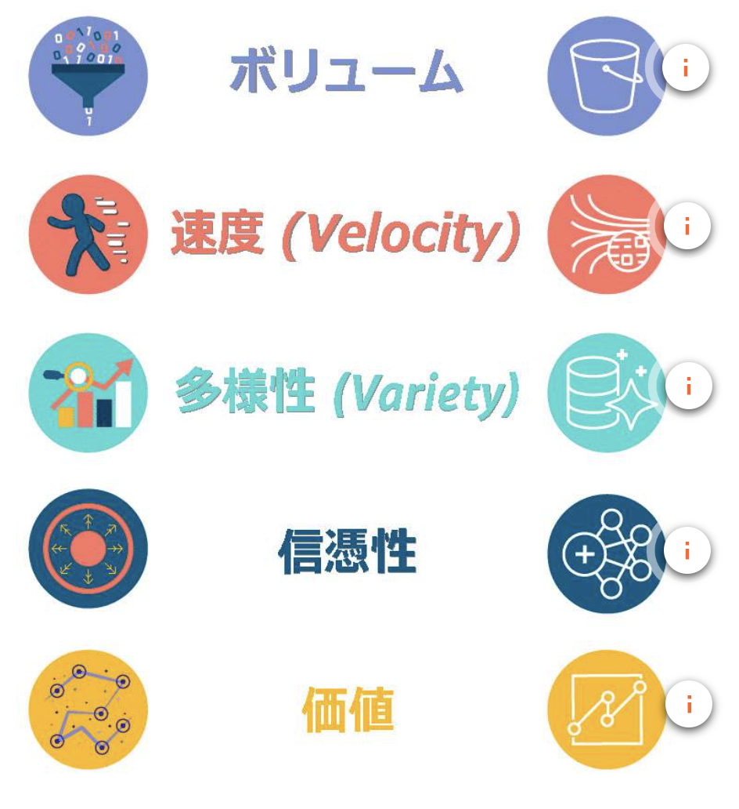

#### データ分析ソリューションを計画する
* データの取得元
  * オンプレミスのデータベース・ファイルストア
  * ストリーミングデータ
    * リアルタイムで正確に集計して分析するには、特別なソフトウェア・アプリケーションが必要になる場合も
  * パブリックデータセット
    * ビジネスに必要な情報のみが含まれるように、変換が必要になる場合も
* データを処理するためのオプションを知る
* データから何を学ぶかを知る

## レッスン2: ボリューム - データストレージ
レッスンで扱うトピック
* Amazon Simple Storage Service (Amazon S3) の紹介
* データレイクの紹介
* データストレージメソッドの紹介

### ビジネスデータの急激な増加
* 企業がその処理および分析能力を超えたデータを抱えると、ボリュームの問題が発生する
* 企業におけるデータの構造化、半構造化、非構造化の比率は 80:10:10 との研究も

### トピック1: Amazon S3の紹介
Amazon S3: 任意の量のデータの保存と取得をどこからでも行えるように設計されたオブジェクトストレージです
* オブジェクト: ファイルおよび任意のメタデータで構成
* バケット: オブジェクトの「入れ物」
  * アカウントに1つ以上のバケットを配置でき、バケットごとにアクセスを制御可能
  * バケットのオブジェクトを作成、削除、一覧表示できるユーザーを指定可能
* オブジェクトの識別子
  * `s3://{bucket}.s3.amazonaws.com/{prefix}/{object}`
  * `{prefix} + {object}` = object key
* S3の利点
  * ストレージをコンピューティング・データ処理から疎結合化
  * 一元化されたデータアーキテクチャ
  * クラスターレス
  * サーバレスなAWSサービスとの結合
  * 標準化されたAPI

### トピック2: データレイクの概要
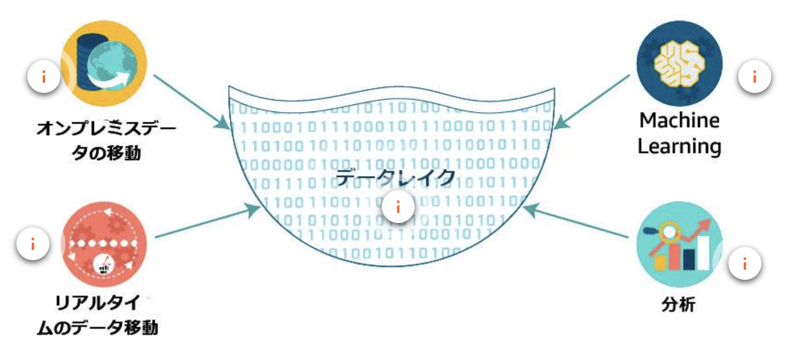

* データレイク: 規模にかかわらず、構造化データ、半構造化データ、非構造化データを保存できる一元管理リポジトリ
* AWSはS3でこれを実現
* データレイクの利点
  1. ほぼ無制限の量のデータを永続的に保存
  2. セキュリティとコンプライアンス
  3. 様々なデータ収集ツールや取り込みツールを利用可能 (ex. Kinesis)
  4. データを簡単かつ効率的に分類・管理 (ex. Glue)
  5. データを意味のある情報に変換 (ex. EMR)

#### データレイクの準備
> データサイエンティストは、時間の 60％をデータのクリーンアップと
> 整理に費やし、19％ をデータセットの収集に費やしています。

* AWSのデータレイクは、次の作業に役立つ
  * データの形式や規模を問わず、低コストで収集し保存する
  * データを保護し、不正アクセスを防ぐ
  * 中央リポジトリでデータを管理し、カタログ作成、検索、有用なデータの特定を行う
  * 新しいタイプのデータ分析をすばやく簡単に実行する
 * ワンタイム分析、リアルタイムストリーミング、予測分析、AI、機械学習を扱う幅広い分析エンジンを利用する
* AWS Lake Formation (現在はプレビュー版のみ利用可)
  * データの整理とキュレーション
    * データの取り込み、消去、カタログ化、変換、保護が簡単に
  * データレイク全体のデータを保護
  * 変換ジョブを他のAWSサービスと調整
  * 安全なデータレイクを数日で簡単にセットアップ可能

### トピック3: データストレージ方法の概要
#### データウェアハウス
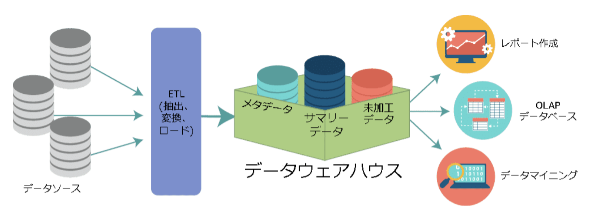

* 1つ以上のデータソースからもたらされる情報の中央リポジトリ
* データは、トランザクションシステム、リレーショナルデータベース、その他のソースからデータウェアハウスに流れる
* これらのデータソースには、構造化データ、半構造化データ、非構造化データを含めることができるが、データウェアハウスに保存される前に構造化データに変換される
* データを格納する方法はスキーマで定義 (RDBと同じ)
* I/O を最小化するよう効率よくデータを保存、何百・何千というユーザーからのクエリを高速かつ同時に処理

#### データマート
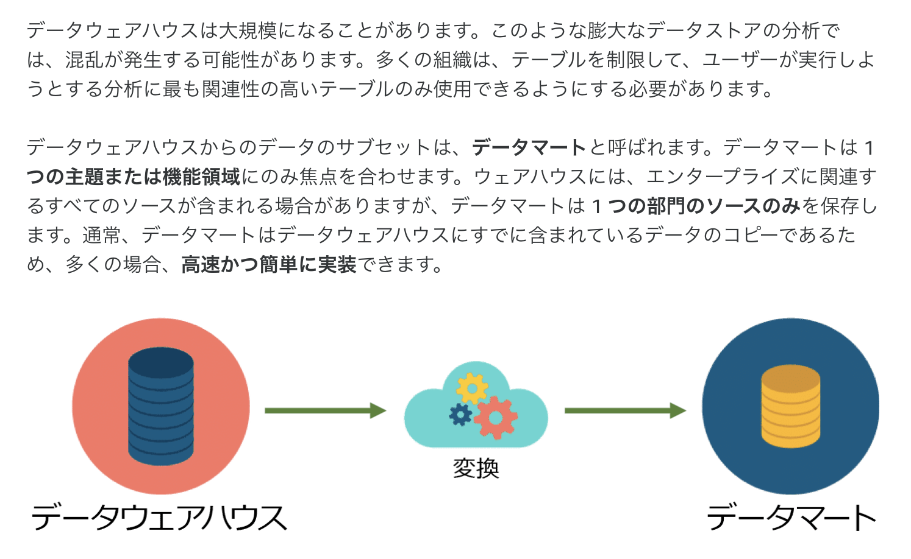

* データウェアハウスからのデータのサブセットを、データマートと呼ぶ
* データマートは1つの主題または機能領域にのみ焦点を合わせる

#### データウェアハウスとデータレイクの比較

| 特徴 | データウェアハウス | データレイク |
|--|--|--|
| データ | トランザクションシステム、運用データベース、基幹業務アプリケーションからのリレーショナルデータ | IoT デバイス、ウェブサイト、モバイルアプリケーション、ソーシャルメディア、企業アプリケーションからの非リレーショナルおよびリレーショナルデータ |
| スキーマ | データ格納前に設計 (スキーマオンライト) | データ分析時に解釈 (スキーマオンリード)
| 価格/ パフォーマンス | 高コストのストレージを使用してクエリ結果を最速で取得 | 低コストのストレージを使用してクエリ結果をより速く取得 |
| データ品質 | 高度にキュレートされたデータで、確度の高い情報源 | 任意のデータで、キュレートできるかどうかは不明 (例: 未加工データ) |
| ユーザー | ビジネスアナリスト | (キュレートされたデータを使用する) データサイエンティスト、データ開発者、ビジネスアナリスト | 
| 分析 | バッチレポート、BI、可視化 | 機械学習、予測分析、データ検出、プロファイリング |

#### DWHとOLTPデータベースの違い
* データウェアハウス
  * 高度に構造化されたデータセット用のストレージを提供し、
    分析クエリの信頼できる唯一のソースとして機能
* OLTP データベース
  * 新規および頻繁に更新されるデータの構造化ストアとして機能。分析クエリが頻繁に実行されると、パフォーマンスが低下する場合がある

## レッスン3: 速度 - データ処理
レッスンのトピック
* データ処理方法の概要
* バッチデータ処理の概要
* ストリームデータ処理の概要

### 収集と処理
* 収集: 複数のソースから分析のためのデータを集めること
* 処理: データの初期化・整理により意味のある情報の生成・管理すること

### トピック1: データ処理方法の概要
* 処理の要件
  * バッチ処理: データの大規模バースト
    * 計画的
    * 定期的
  * ストリーム処理: データの小規模バースト
    * リアルタイム (数秒〜数十秒)
    * ほぼリアルタイム (〜数分以内)
  * 処理の要件によって利用するサービスも違う

### トピック2: バッチデータ処理の概要
* バッチ処理は、手動介入なしに1〜複数台のマシンで連続したジョブ(プログラム)を実行すること
* 大量のデータを一度にすばやく効率的に処理する必要がある
* 特定の条件(指定された時刻など)が満たされると、処理システムに送信される
* Amazon EMR: Hadoopワークロードを実装するためのマネージドサービス。EMR Notebooksという開発環境もある？

#### バッチ処理型アーキテクチャ
* ベーシックな構成例
  * データソース -> S3 -> Lambda -> EMR -> Redshift
  * Lambda はスケジュール動作
  * EMRでETL処理(集計やロード処理)を実現
  * EMRでのApache SparkにはMLibも含まれるため、機械学習のようなワークロードも実現可能
* Glueを用いた構成例
  * データソース -> S3 -> Lambda -> Glue -> Redshift
  * GlueはEMRとは対象的にフルマネージドなサービス
  * EMRの替わりにETL処理を実行

### トピック3: ストリームデータ処理の概要
* ストリーミングソリューションは一般的に、プロデューサーとコンシューマーにわかれる
* 各プロデューサーは同一のエンドポイントにデータを書き込むことができるため、
  複数のデータストリームを１つのストリームに結合して処理可能
* データのクライアント順序を維持し、データの並列実行が可能に

#### ストリーム処理アーキテクチャ
* 構成例
  * センサーデータ -> 収集レイヤー[Kinesis Data Firehose] -> 処理レイヤー[Kinesis Data Analytics -> Kinesis Data Firehose] -> S3 -> Athena -> Quicksight
  * 処理レイヤーのKinesis Data Analyticsで関連するレコードのデータをフィルタリング。Kinesis Data FirehoseでS3に結果を送信

#### 結合処理アーキテクチャ
Kinesis Data Firehose -> S3に格納されたセンサーデータと、事前にS3に格納されたデバイスの設定データをGlueで結合し、
サービスレイヤーのS3にロードした例

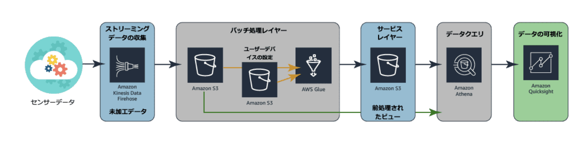

ストリームデータ処理とバッチデータ処理を結合したEnd to Endのソリューションの例

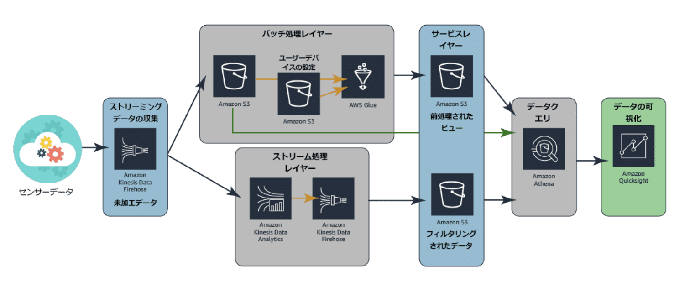

> AWSが [ハンズオンのチュートリアル](https://aws.amazon.com/jp/getting-started/hands-on/build-log-analytics-solution/) を用意してくれているので、試してみてもよさそう

## レッスン4: 多様性 - データの構造とタイプ
レッスンで扱うトピック
* ソースデータストレージの概要
* 構造化データストアの概要
* 半構造化データストアと非構造化データストアの概要

### トピック1: ソースデータストレージの概要
* 構造化データ
  * 一般的に、データベース管理システム (DBMS) にテーブル形式で保存
  * データ要素とそれらの相互関係を定義および標準化するリレーショナルデータモデルに基づいて整理
  * テーブル内の各フィールドが何を表すかを説明するテーブルスキーマによって表現
  * 欠点は **柔軟性がないこと**
    * 例えば、顧客の年齢を追跡する要件が追加された場合、この新しいデータを受容するようにスキーマを再設計する必要がある
  * 構造化データアプリケーションには、Amazon RDS、Amazon Aurora、MySQL、MariaDB、PostgreSQL、Microsoft SQL Server、Oracle などがある
* 半構造化データ
  * 一般的に、ファイル内の要素の形式で保存
  * データ要素とそれを定義する属性（プロパティ）に基づいて整理されます
  * データモデルやスキーマには準拠せず、自己記述式の構造を持つと見なされる
  * トレードオフは **分析** 
    * データアナリストが特定のデータセットに存在する属性を予測できない場合、半構造化データの分析が困難になることがある
  * 半構造化データストアの例は、CSV、XML、JSON、Amazon DynamoDB、Amazon Neptune、Amazon ElastiCache などがある
* 非構造化データ
  * 一般的に、ファイルの形式で保存される
  * 事前定義されたデータモデルに準拠せず、事前定義された方法で整理されない* 非構造化データには、テキスト中心のデータ、写真、音声録音、動画などが含まれる
  * 非構造化データには無関係な情報が大量に含まれているため、意味のある分析を行うにはファイルを事前処理する必要がある
  * 非構造化データの例は、E メール、写真、動画、クリックストリームデータ、Amazon S3、Amazon Redshift Spectrum などがある

> * 構造化データは熱々(Hot)で、すぐに分析できる
> * 半構造化データは生ぬるく、すぐに分析できるものもあれば、クレンジングや事前処理が必要なデータもある
> * 非構造化データは凍った(Cold)海。必要なもので満ち溢れている一方、あらゆる種類の不要なもので分断されている

### トピック2: 構造化データストアの概要
* フラットファイルデータ: ワークシートやスプレッドシートのように表形式で表現されるデータのこと。スキーマによるチェックがなく厳密には構造化されない
* リレーショナルデータベース: テーブルおよびテーブル間の関係性を明確かつ厳格に管理可能なシステムのこと

#### 情報システムの種類
* OLTPデータベース (運用データベース)
  * OLTP=オンライントランザクション処理
  * 主にデータ入力の速度に重点をおいてデータを論理的に整理
  * これらのデータベースはInsert,Update,Deleteが多いという特徴がある
* OLAPデータベース (データウェアハウス)
  * OLAP=オンライン分析処理
  * 主にクエリによるデータ取得の速度に重点をおいてデータを論理的に整理
  * 書き込みオペレーションが比較的少なく、UpdateおよびDeleteがないという特徴がある

| 特徴 | OLTP | OLAP |
|--|--|--|
| 性質 | 間断ないトランザクション | 定期的で大規模な更新、複雑なクエリ |
| 例 | 経理DB、小売トランザクション | レポート、意思決定支援 |
| タイプ | 運用データ | 統合データ |
| データ保持 | 短期(2〜6カ月) |  長期(2〜5年) |
| ストレージサイズ | GB | TB/PB |
| ユーザー | 多数 | 少数 |
| 保護 | 堅牢で一貫性のあるデータ保護と対障害性 | 定期的な保護 |

#### 行指向/列指向データベース
* 行指向データベース
  * 行ベースにインデックスを作成
  * 行指向のOLTP/OLAPシステムをAmazon RDSで構築可能
* 列指向データベース
  * 列ベースにインデックスを作成
  * 列指向のOLAPシステムをAmazon Redshiftで構築可能

| | 行ベースインデックス | 列ベースインデックス |
|--|--|--|
| ディスク上のストレージ | 行単位 | 列単位 |
| 読み取り/書き込み | ランダムな読み書きに最適 | シーケンシャルな読み書きに最適 |
| 最適な用途 | キーに基づいてすべてのデータ行を返す | 列値の集計データを返す |
| 実装 | トランザクションシステム | 分析処理 |
| データ圧縮 | 低〜中程度の圧縮 | 一般的に高圧縮 |

#### ケーススタディ
1. オンプレミスなDBをクラウドに以降する場合に適切なオプションを決定することが大きな課題
    * Amazon RDSを使用
2. 分析リクエストにより、トランザクションシステムがすぐに過負荷になる
    * Amazon Redshiftを使用
    * 自身のDWH内のデータやS3に保存されたデータに対してクエリを実行
      * Amazon Redshift Spectrum : S3データに対して直接クエリを実行可能
      * https://dev.classmethod.jp/articles/amazon-redshift-getting-started-with-spectrum/

### トピック3: 半構造化および非構造化データストアの概要
#### 非リレーショナルデータベース
* 非リレーショナルデータベースは、半構造化データと非構造化データを迅速に収集と取得ができる形で、保存するように作られている
* NoSQLも非リレーショナルデータベースに含まれるとする
* ドキュメントストア
  * JSONやXMLの総称。一連のエレメントが保存されたデータに含まれる
  * 強み
    * 柔軟性、拡張が容易、作成時にデータ構造を計画する必要がない
  * 弱点
    * （データ更新のタイミングによって）[ACID](https://ja.wikipedia.org/wiki/ACID_(%E3%82%B3%E3%83%B3%E3%83%94%E3%83%A5%E3%83%BC%E3%82%BF%E7%A7%91%E5%AD%A6))コンプライアンスが犠牲になる
    * ファイルをまたいだクエリが不可能
* キーバリューストア
  * Key-Valueのペア形式で非構造化データを保存する非リレーショナルデータベースの一種
  * 強み
    * 非常に柔軟、様々なデータ型を処理できる、インデックス操作・複雑な結合操作を必要としない、キーのコンテンツを他のシステムに容易にコピー可能
  * 弱点
    * 単一のblobとして保存されるため、値をクエリできない
    * 値の内容を更新することが困難
    * すべてのオブジェクトがKey-Valueのペアとして簡単にモデルかされるわけではない (ex.リスト)

#### スキーマの変更
* リレーショナルデータベース
  * 新たな要素を追加する場合
    1. SQLコマンドを実行して列を追加
    2. テーブルに空の列が含まれる
    3. 新しい列に既存の各レコードに値を入力
* 非リレーショナルデータベース
  * 新たな要素を追加する場合
    * その要素をもつレコードを追加するだけ…（各レコードは独自の属性をもてるから）
    * （各レコードの属性が一致していないような状態で、Redshift SpectrumやAthenaって動くのだろうか？）

#### AWSでのオプション
* 非リレーショナルデータベース: DynamoDB, ElastiCache
* グラフデータベース: Naptune

#### 非リレーショナルデータベースの長所と短所
* 利点
  * 動的なスキーマを介してRDBの限界を超えられる
  * その結果、開発サイクルやダウンタイムが短縮される
  * スケーリングに有利で、より大規模なデータセットを処理できる
* 欠点
  * 「結果整合性」：データ変更のタイミングでなくバックグラウンドタスクでこれらの整合性が追いつく
  * 多くの状態では許容されるもの、ACIDコンプライアンスの達成が困難
  * 極めて低いトランザクションレンテンシーが必要とするアプリケーションにおいて、RDBほどパフォーマンスがうまく出せない
  * 成熟度もフィールドの専門知識量もRDBには現時点では到底及ばない

| 特徴 | リレーショナル | 非リレーショナル | グラフ |
|--|--|--|--|
| 表現 | 列と行を含む複数のテーブル | ドキュメントの集合、キーと値を持つ単一のテーブル | ノードとリレーションシップの集合 |
| データ設計 | 正規化されたRDB、またはディメンション（多次元）データウェアハウス | 非正規化エンティティリレーションシップ |
| 最適化 | ストレージに最適 | コンピューティングに最適 | リレーションシップに最適 |
| クエリスタイル | SQL | 言語多数。オブジェクトクエリを使用 | 同左 |
| スケーリング | 垂直スケーリング | 水平スケーリング | ハイブリッド |

## レッスン4: 信憑性 - クレンジングと変換
レッスンで扱うトピック
* データの整合性について理解する
* データベースの一貫性について理解する
* ETLプロセスの紹介

#### 用語の定義
* キュレーション: コレクション内のアイテムを選択、整理、整備するアクションまたはプロセス
* データの整合性: データのライフサイクル全体にわたって維持、保証されている正確性と一貫性
* データの信憑性: データの正確性、精度、信頼性の度合いのことです

#### 信憑性の問題
* データは時間の経過とともに変化する
* プロセス間やシステム間で転送されているうちに、データの整合性が低下する場合がある。自分が分析しているデータが信頼できるものであるという確実性を、高いレベルに維持する必要がある

### トピック1: データの整合性について理解する
#### データの整合性とは
* データの整合性=データの信頼性を確保すること
* データチェーン全体が安全で妥協はないか。データの全ライフサイクルと効果的に保護する方法を理解する=データの整合性が大幅に強化される
  * 作成フェーズ: データの正確性を確保することが重要
  * 集計フェーズ: エラーはほぼあり得ない。集計間の比較は注意が必要
  * ストレージ: データの意図しない更新。改ざんの被害を防ぐようなセキュリティ対策も考慮する
  * アーカイブ: 当座の利用価値を失った場合、アーカイブに移動させる。アクセス制限を設ける等してセキュリテをを確保する
  * アクセス: システムを読み取り専用とし、異常について定期的に監査
  * 共有: ビジネスユーザーが表示された数字とのレポートに対する期待が一致しなかった場合、データの信憑性が問題に上がる

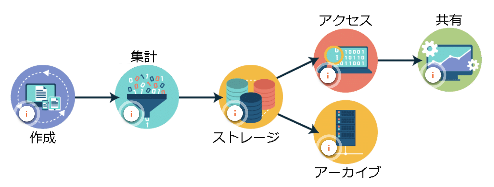

#### データの整合性に必要なプロセス
* データクレンジング: データ内のエラーを検出して修正するプロセス
* 参照整合性: テーブルリレーションシップの制約が適用されていることを確認するプロセス
* ドメイン整合性: フィールドに入力されるデータと定義されている型が一致していることを確認するプロセス
* エンティティ整合性: フィールド内に保存された値が定義された制約に一致していることを確認するプロセス

#### データ整合性の問題の特定
* 社外から得たデータソースに影響を与えられることはまずないが、社内にあるソースには改善についての提言ができるかもしれない
* データソースの収集システムを変更できない場合、問題のデータソースの整合性の判定や対処法は、データ分析者の責務となることがしばしばある
* データの整合性の問題を特定するベストプラクティス
  1. クリーンの状態を定義する
      * ビジネスルールが適用された未加工なデータなのか、正規化や補完されたデータなのか
  2. 許容できる変更とは何かを知る
      * 補完処理が後続の処理に思わぬ影響を与えることがある
  3. エラーの発生元を知る
      * 考えられるソースまでエラーを追跡する（監査証跡）
  4. 元のデータに価値があるかどうかを知る
      * 開発するシステムや要件で、データのトレーサビリティが重要度が変わる
* **データ整合性評価の要件は上記の1,2**。3の作業も役立つことはあるが要件にはあたらない

#### データベーススキーマ
* RDBでは、データベースのコンテンツを整理し、参照整合性とドメイン整合性を高めるために、データベーススキーマに利用する
* また、プログラマーは、DBとのインターフェイスとなるソフトウェアを作成するときにも、これらのスキーマを使用する
* データスキーマは論理スキーマと物理スキーマにわけられる
  * 論理スキーマ
    * データベース内のデータに適用する制約を与え、テーブル、ビュー、整合性チェックを実現する
  * 物理スキーマ
    * ディスク上またはクラウドリポジトリ内のデータの実際のストレージに焦点が当てられている
    * 具体的には、ファイル、インデックス、パーティションテーブル、クラスターなどに関する詳細が含まれる

#### インフォメーションスキーマ
* DBMSがデータベース内のデータオブジェクトに関する情報を格納する、メタデータのデータベースのこと
* インフォメーションスキーマでクエリを実行し、データベース内のオブジェクトについて知ることができ、この情報を使用してクエリに対する最適化を検討などの保守作業を進めることができる

### トピック2: データベースの整合性を理解する
* データがファイルとして保存されている場合、整合性はアプリケーションによって制御
* データがDBに保存されている場合、整合性はDBで制御
* このトピックでは、DBに実装される2つの方法 **ACIDとBASE** について説明

#### ACID
**ACID** とは、Atomicity (アトミック性)、Consistency (整合性)、Isolation (分離性)、Durability (耐久性) の頭字語で、構造化データベースの一貫性と整合性を維持する方式

#### ACID準拠
ACID準拠のデータベースの目的は、すべてのデータの最新バージョンを返し、システム内のデータを割り当てられたすべてのルールと制約に常に適合させるため

* アトミック性: トランザクションが完全に実行されるか、まったく実行されないかのいずれかであることを保証する（コミット・ロールバックの保証）
* 整合性: すべてのトランザクションにおいて、有効なデータが提供されることを保証する（スキーマ適合の保証）
* 分離性: あるトランザクションによって、同時に実行されている別のトランザクションが影響を受けないことを保証する（並列実行の保証）
* 耐久性: 変更が確実に維持されるようにすること（コミットに対する永続化の保証）

これら4つすべての特性が連動することで、RDBの一貫性が確保されます。このような性質が必用な場合、企業はACID準拠データベースを使用する必要があります。しかし、企業のデータ利用における非構造化データ、非リレーショナルデータ、分散システムの割合は高くなる一方であり、別の選択肢が必要です

#### BASE
**BASE** とは、Basically Available (基本可用性)、Soft state (柔軟な状態)、Eventually consistent (結果整合性) の頭字語で、構造化データベースまたは半構造化データベースの一貫性と整合性を維持する方式

#### BASE準拠
非リレーショナルデータベース (NoSQL データベースとも言う) は非常にアクティブが使われ方をしており、主な懸念事項となるのはデータの整合性よりもデータの可用性となる。データの高可用性を確保するために、データに対する変更は、変更が行われたインスタンスですぐに利用可能になる。ただし、その変更がインスタンスのフリート全体にレプリケートされるまでには時間がかかる場合があるが、最終的にはフリート全体で変更内容を完全に整合させる

* 基本可用性（Basically Available）
  * 変更リクエストが直ちに使用可能になること
  * ただし、変更がすべてのシステムのノードにレプリケートされなかった場合は、応答が失敗するか、データが古くなる可能性がある
  * ACIDシステムでは、すべてのインスタンスが整合するまで変更は利用可能にならないが、BASEモデルでは、整合性と引き換えに可用性に重点を置いている
* 柔軟な状態（Soft state）
  * 分散インスタンス間での部分的な整合性が許容される。このため、BASEシステムは柔軟な状態 (変更可能な状態) であると見なされる
  * ACID システムでは、完全に整合していないデータにはアクセスできないため、データベースは厳密な状態であると見なされる
* 結果整合性 (Eventually consistent)
  * データは結果的に整合。つまり、最終的にはすべてのコピーに変更が適用される。ただし、データは変更適用のどの段階にあっても利用できる

| ACID準拠 | BASE準拠 |
|--|--|
| 強い整合性 |  弱い整合性 – 古いデータは問題なし |
| 分離性が重要 | 可用性が重要 |
| コミットされた結果に重点 | ベストエフォート結果 |
| 保守的 (悲観的) 可用性 | 積極的 (楽観的) 可用性 |

### トピック3: ETLプロセスの概要
* ソースデータが分散している場合、統一したスタイルで整理しながら開発されることはまずな
い
* データのコンテキストや信憑性を担保するには、変換によりデータの整合性を獲得する必要がある

#### ETLを理解する
ETL（Extract：抽出、Transform：変換、Load：ロード）とは、未加工なデータを収集し、そのデータを共通の形式に変換すること

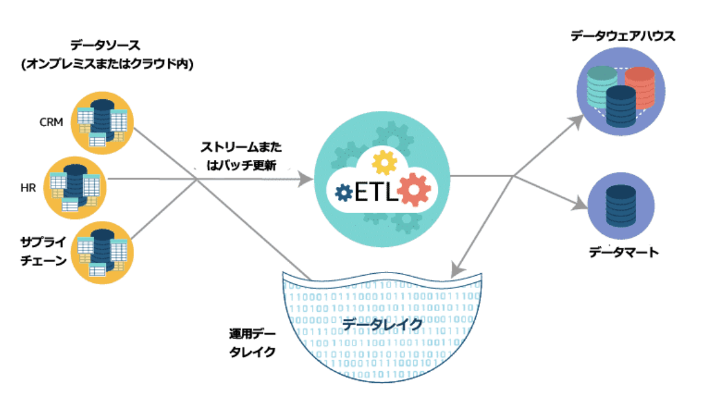

##### データソース
* 適用可能なサービス例
  * ファイルベースのデータ: Amazon S3
  * トランザクションデータ: Amazon RDS
  * 分析データ: Amazon Redshift
  * 非リレーショナルデータ: Amazon DynamoDB

##### データの抽出

* データソースは多くの場合は複数の場所にあり種類も様々（ログ、製品DB、パブリックDB、アプリケーションストリームなど）
* 以下について計画する必要がある
  1. すべてのソースデータの場所の特定
  2. 抽出の実行タイミングの計画
  3. 処理中のデータを保存する場所（=ステージングロケーション）の計画
  4. 抽出の頻度の計画
* 適用可能なサービス例
  * ストリーミングデータ: Amazon Kinesis
  * バッチワークロード: Amazon EMR, AWS Glue

##### データの変換
* 最大の目的はデータをクエリ可能な何らかの形式に変換すること
* 例をあげると
  * データをクリーンアップしてフォーマットを変換
  * NULLを何らかの値で補完したり、Femaleを `'F'` に変換
  * ビジネスルールを適用して新しい値を算出
  * フィルタリング、複雑な結合、行の集計、列の分割
* AWSのETLサービスでは、非リレーショナルデータをリレーショナルデータに変換したり、リレーショナルデータを取得してS3に保存するJSONファイルに変換するなど、データソースタイプ間の変換も可能
* 適用可能なサービス例
  * データの抽出と同じ

##### データのロード
* 最終的なデータストアに変換されたデータをロードする
* データストアの形式は、データベース、データウェアハウス、データレイクなどが考えられる
* 適用可能なサービス例
  * データソースと同じ

### データの変換 - Amazon EMR と AWS Glue の比較
どちらのオプションも同等の結果が得られるが、必要な知識量と工数が異なる

* Amazon EMR
  * データの収集と処理の堅牢なプラットフォームな反面、技術スキルやノウハウが必要
  * ビジネスニーズに合わせてパイプラインをカスタマイズ可能
  * AWS Glueで同じワークロードを実行するより、インフラにかかるコストが低くなる場合もある
* AWS Glue
  * EMRよりも遥かにシンプルに操作できるマネージド型のサーバーレスETLツール
  * 単純なETLタスクには適しているが、EMRほどの柔軟性はない
  * AWS Glueデータカタログ（Hiveメタストアに互換する代用品）を使用して変換した最終データのメタストアとして使用することもできる

## レッスン6: 価値 - レポート作成とビジネスインテリジェンス
レッスンのトピック
* データ分析の基本
* データ可視化の基本

### トピック1: データ分析の基本
#### データ分析
データ分析とは
* 情報分析: 情報を分析してその中に含まれる価値を見つけるプロセス（広義のデータ分析）
* 運用分析: 情報分析とよく似ているが、組織のデジタル運用が主な分析対象

#### 情報分析
* 仮定にもとづいたけ決断ではなく、データにもどつく決断を下すためのインサイトを提供するための分析
* そのためには、収集するあらゆるデータから意味のある情報を迅速かつ効率的に取得し、継続的にインサイトを提供する必要がある

#### 運用分析
* IT活動に必要なデータを取得、分析、報告する目的のみに使用される分析
* 具体的には、システムログ、セキュリティログ、複雑なITインフラストラチャイベントやプロセス、ユーザートランザクション、セキュリティ上の脅威が含まれる
* AWSでは、Amazon Elasticsearch Serviceが通常使用される

#### 分析のタイプ
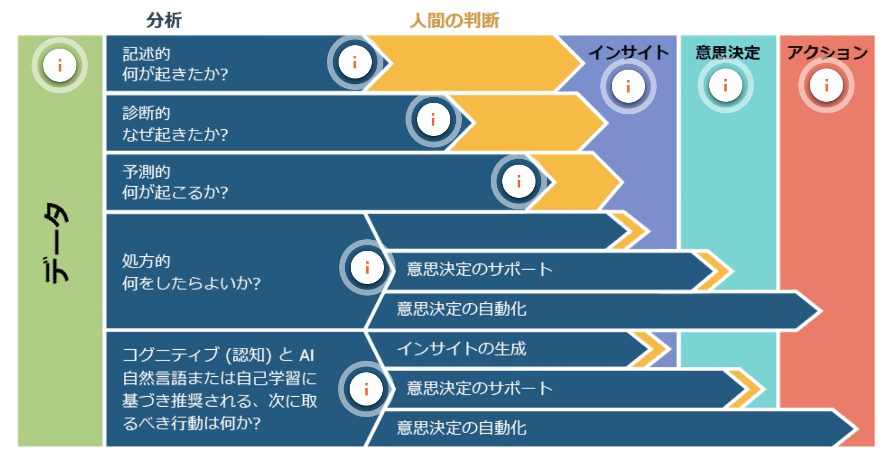

> Gartner社 「2017 Planning Guide for Data and Analytics」 から引用

* 記述的分析（Descriptive Analytics）
  * 「何が起こったか」を解明するための分析方式
  * 事後の解釈に分析の焦点を絞る
  * データマイニングと呼ばれることもよくある
  * この分析方式は、人的労力と解釈を最も必要とする
  * 例
    * 金融データを分析して収益率が最大の商品情報を生成
    * チケット売上を分析して昨年最も売上が高かったミュージシャンを特定
* 診断的分析（Diagnostic Analytics）
  * 「なぜ起こったか」を解明するための分析方式
  * 事後の解釈とインサイトに分析の焦点を絞る
  * この方式を使用すると、データをドリルダウンして、回答のヒントとなる依存関係やパターンを見つける可能性がある
  * 例
    * ソーシャルメディアの投稿を分析して顧客心理の傾向をつかむ
    * 患者の通院と通院理由を分析して治療傾向を把握する
* 予測分析（Predictive Analytics）
  * 「何が起こるか」を解明するための分析方式
  * インサイトと先見に分析の焦点を絞る
  * 記述的および診断的分析の結果を使用して、将来のイベントの傾向を予測
  * 方式の精度は、データの質と予測される状況の安定性に大きく左右される
  * 例
    * 顧客の購買行動を分析して関連商品を勧める
    * 投資データ、市場データ、物件価値を分析して、新支店の候補地を予測する
* 処方的分析（Prespective Analytics）
  * 「何をしたらよいか」を解明するための分析方式
  * 先見に分析の焦点を絞る
  * 提供されたデータにもとづき取るべきアクションを明確にする
  * 他のすべての分析形式の入力データをルールと制約ベースの最適化と組み合わせて、関連する予測を立てる必要がある
  * この方式の最大のメリットは自動化できる点。自動化は機械学習モデルなどで実現
  * 例
    * 株式の購入や広告のリリースに最適な時期を予測
    * 高血圧の患者数に関する情報と多様な治療に関する統計を収集し、特定の患者に最も効果がある治療法を予測
* 認知知能と人工知能
  * 「推奨するアクションは何か」を解明するための分析方式
  * 画像データ、音声データ、文書データなどを直接的にあつかう
  * 既存データの関連性、制約にもとづき仮定が提唱され、回答として推奨事項と信頼性ランクが提供される（いわゆる推論）
  * 例
    * Amazon Alaxaなどの人工アシスタント
    * 医療記録、医療刊行物の記事、経済、地理的制約を組み合わせて、おすすめの治療プランを立てる
* 分析により得られる結果
  * インサイト
    * 分析を通じて得ようとする質問の答え、事実、数字
  * 意思決定
    * 分析結果にもとづいて決断を下す
    * 生成されたインサイトは、決断を正当化し確信を抱くために不可欠
  * アクション
    * 分析の効果を最終的に実証するための行動そのもの

#### 予測分析
機械学習スタックの主な3つのレイヤー
1. アプリケーションサービス
    * 開発者は、事前に構築されたAI機能をアプリに接続するため、MLモデルにかける労力を削減可能
2. プラットフォームサービス
    * 開発者は、かんたんにMLの利用を開始して使いこなすことが可能
3. フレームワークとインターフェース
    * 開発者は、MLモデルの自由なカスタマイズか可能

Amazon Machine Learningの使用実例
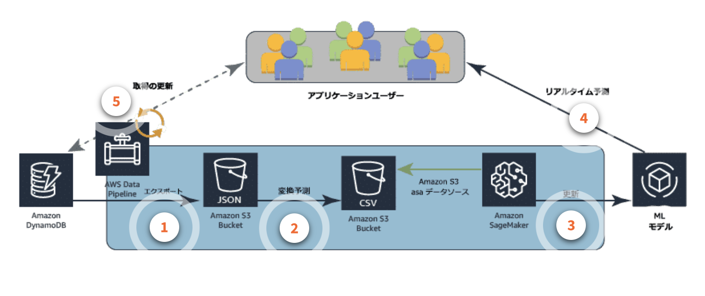

#### 認知的分析
人的な関与がなく、初期設定やMLモデルのトレーニングプロセスを経る必要もなく、専門性の高いプランを提供することが可能

#### 分析サービスと速度
* バッチ分析
  * 大量のコールドデータを参照し、定期的なスケジュールで大量の分析結果を生成
  * Apache Hadoopで実行されるフレームワークなどを用いて効率的に分析を実行
  * こういったフレームワークはAmazon EMRクラスタにインストール可能
* インタラクティブ分析
  * ユーザーがクエリを実行して結果をすぐに確認できる
  * Amazon Athenaでは、標準的なSQLクエリを利用してS3のデータを直接分析できる
  * Amazon Elasticsearch Serviceでは、ほぼリアルタイムでデータの検索、調査、フィルタリング、集計、可視化が可能
  * Amazon Redshiftでは、PB規模の構造家データに対して複雑な分析クエリを実行可能
  * さらに、AMazon Redshift Spectrumを利用すると、S3に保存されているEB規模の構造家データまたは非構造化データに対して直接SQLクエリを実行可能
* ストリーム分析
  * データレコードが供給される度にメトリクス、レポート、サマリー統計を更新
  * Amazon Kinesisでは、ストリーミングデータの取り込み・分析を簡易化するサービスを提供
  * Amazon Lambdaでは、ストリームデータの形式の変換、変更、強化、フィルタ処理が可能
  * 独自にストリーミングデータプラットフォームを構築したい場合は、Amazon EC2やAmazon EMRによるソリューションの構築でもよい
  * その他、Apache Spark StreamingやApache Stormなどの選択肢もある

#### データ分析ソリューションとAWSサービス
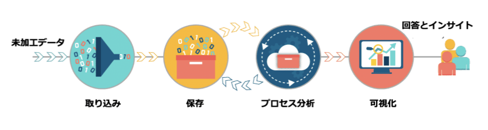

* 取り込み/収集: Kinesis, EMR, Glue
* 保存: S3/S3 Datalake, RDS, DynamoDB, Redshift
* 処理/分析: ML, EMR, Glue, Kinesis Data Analytics, Athena
* 処理/可視化: Redshift, Athena, Quicksight

### トピック2: データ可視化の概要
#### データの準備
1,2,3は情報分析プロセスで既出。ここでは4について述べる
1. データの検査
2. データのクレンジング
3. データの変換
4. データの可視化

#### レポートのタイプ
* 静的レポート
  * PDF、PowerPointのスライドといった形式
* インタラクティブレポート
  * 表やグラフにフィルタを適用できたり、スケールを変更したり、レポート内のグループ化や並び替えが可能。インサイトの詳細を解析したいユーザーにフォーカス
* ダッシュボード
  * インタラクティブレポートと形式は似ているが、複雑なレポートをユーザーがより理解しやすくなることにフォーカスされている

インタラクティブレポートおよびダッシュボード向けに、BIサービスとしてAmazon Quicksightが利用できる

#### レポート作成のベストプラクティス
1. データ、事実、アクション項目、結論を集める
2. 読み手、読み手の期待、適切な配信方法を特定
3. 読み手のニーズに最も合った可視化のスタイルとレポートのスタイルを決定
4. レポートとダッシュボードを作成

## レッスン7: 要点のまとめ
### トピック1: ピースをつなぎあわせる
これまで登場したサービスのラップアップ

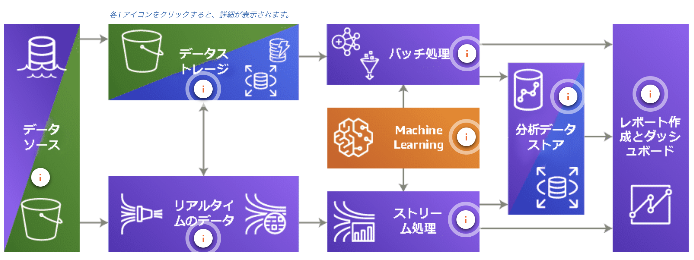

### トピック2: 次のステップ
#### データ分析における職種
* データプラットフォームエンジニア
* データパイプラインエンジニア
* データアーキテクト
* データアナリスト
* データサイエンティスト

#### AWSトレーニング
トレーニングを受講して認定テストを受けよう
