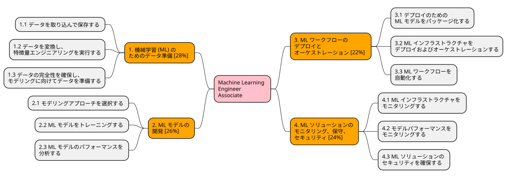

# MLA-C01 概要

MLA-C01 AWS Certified Machine Learning Engineer - Associate

## 試験概要

https://aws.amazon.com/jp/certification/certified-machine-learning-engineer-associate/

* 形式: 65個の設問（単一回答・複数選択・並べ替え・内容一致）
  * うち採点対象: 50問、採点対象外（プレテスト）: 15問
* 時間: 130分
* 価格: 150 USD
* 受験方法: ピアソンVUEのテストセンターまたはオンライン監督付き試験
* 合格ライン: 720点（得点範囲：100〜1000点）
* 対象受験者: Amazon SageMaker をはじめとする AWS のサービスを利用した ML エンジニアリングの経験が 1 年以上ある方

## 出題範囲

https://d1.awsstatic.com/ja_JP/training-and-certification/docs-machine-learning-engineer-associate/AWS-Certified-Machine-Learning-Engineer-Associate_Exam-Guide.pdf

| 分野 | 比率 |
| --- | --- |
| 1. 機械学習 (ML) のためのデータ準備 | 28% |
| 2. ML モデルの開発 | 26% |
| 3. ML ワークフローのデプロイとオーケストレーション | 22% |
| 4. ML ソリューションのモニタリング、保守、セキュリティ | 24% |

### 分野 1: 機械学習 (ML) のためのデータ準備 [28%]

* 1.1 データを取り込んで保存する
* 1.2 データを変換し、特徴量エンジニアリングを実行する
* 1.3 データの完全性を確保し、モデリングに向けてデータを準備する

### 分野 2: ML モデルの開発 [26%]

* 2.1 モデリングアプローチを選択する
* 2.2 ML モデルをトレーニングする
* 2.3 ML モデルのパフォーマンスを分析する

### 分野 3: ML ワークフローのデプロイとオーケストレーション [22%]

* 3.1 デプロイのための ML モデルをパッケージ化する
* 3.2 ML インフラストラクチャをデプロイおよびオーケストレーションする
* 3.3 ML ワークフローを自動化する

### 分野 4: ML ソリューションのモニタリング、保守、セキュリティ [24%]

* 4.1 ML インフラストラクチャをモニタリングする
* 4.2 モデルパフォーマンスをモニタリングする
* 4.3 ML ソリューションのセキュリティを確保する

## 対象サービス

* 分析
    * Amazon Athena
    * Amazon Data Firehose
    * Amazon EMR
    * AWS Glue
    * AWS Glue DataBrew
    * AWS Glue Data Quality
    * Amazon Kinesis
    * AWS Lake Formation
    * Amazon Managed Service for Apache Flink
    * Amazon OpenSearch Service
    * Amazon QuickSight
    * Amazon Redshift
* アプリケーション統合
    * Amazon EventBridge
    * Amazon MWAA (Managed Workflows for Apache Airflow)
    * Amazon SNS
    * Amazon SQS
    * AWS Step Functions
* コンピューティング
    * AWS Batch
    * Amazon EC2
    * AWS Lambda
    * AWS Serverless Application Repository
* コンテナ
    * Amazon ECR
    * Amazon ECS
    * Amazon EKS
* データベース
    * Amazon DocumentDB
    * Amazon DynamoDB
    * Amazon ElastiCache
    * Amazon Neptune
    * Amazon RDS
* デベロッパーツール
    * AWS CDK
    * AWS CodeArtifact
    * AWS CodeBuild
    * AWS CodeDeploy
    * AWS CodePipeline
    * AWS X-Ray
* 機械学習
    * Amazon Augmented AI (Amazon A2I)
    * Amazon Bedrock
    * Amazon Comprehend
    * Amazon Fraud Detector
    * Amazon Kendra
    * Amazon Lex
    * Amazon Mechanical Turk
    * Amazon Personalize
    * Amazon Polly
    * Amazon Q
    * Amazon Rekognition
    * Amazon SageMaker
    * Amazon Textract
    * Amazon Transcribe
    * Amazon Translate
    * Amazon Lookout for Equipment / Metrics / Vision
* マネジメントとガバナンス
    * AWS Auto Scaling
    * AWS CloudFormation
    * AWS CloudTrail
    * Amazon CloudWatch / CloudWatch Logs
    * AWS Config
    * AWS Organizations
    * AWS Systems Manager
    * AWS Trusted Advisor
* 移行と転送
    * AWS DataSync
* ネットワークとコンテンツ配信
    * Amazon API Gateway
    * Amazon CloudFront
    * AWS Direct Connect
    * Amazon VPC
* セキュリティ、アイデンティティ、コンプライアンス
    * AWS IAM
    * AWS KMS
    * Amazon Macie
    * AWS Secrets Manager
* ストレージ
    * Amazon EBS
    * Amazon EFS
    * Amazon FSx
    * Amazon S3 / S3 Glacier
    * AWS Storage Gateway
