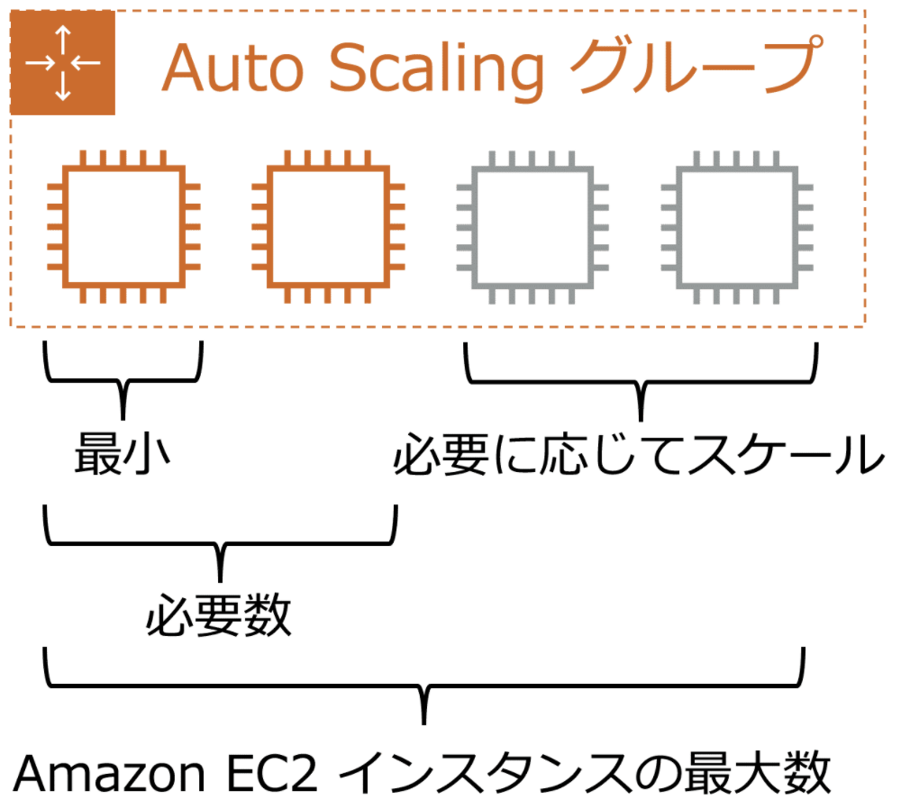

# コンピューティング

---
## EC2
仮想サーバを提供するマネージド型のコンピューティングサービス

### インスタンスファミリー

| ユースケース | ファミリー | 特徴 |
| --- | --- | --- |
| 汎用 | A1,M5,T3 | インスタンスのリソースを同じ割合で消費するアプリケーションに最適 | 
| コンピューティング最適化 | C5,C6g | バッチ処理ワークロード、メディアトランスコード、hpcなどで最適 |
| メモリ最適化 | X1,R5,z1d | メモリ内の大きなデータセットを処理するワークロードに最適 | 
| ストレージ最適化 | H1,D2,I3 | ローカルストレージの大規模データセットに対する高いシーケンシャル読み取り/書き出しに最適 |
| 高速化コンピューティング | P3,G4(GPU),F1(FPGA) | ハードウェアアクセアクセラレータを用いた計算処理に最適 |

### EBS
[EBS](./storage.md#ebs) を参照

### インスタンスストア
* Instance store-backed AMIを利用してインスタンスを作成すると、このインスタンスのデータはインスタンスストア（=物理ホストのローカルディスク）に保存される
* インスタンスストアはインスタンスの存続期間中のみ持続するため、インスタンスが終了すると自動的に削除される

### リザーブドインスタンス（RI）
* オンデマンドインスタンスに適用される割引プラン
  - スタンダード：インスタンスタイプが固定
  - コンパーティブル：スタンダードと比べて割引率は低いが、期間中のインスタンスタイプ変更は可能
* 購入には1年or3年のコミットメントが必要。もし途中で不要になった場合は「リザーブドインスタンスマーケットプレイス」で販売することも可能

### キャパシティ予約
キャパシティを事前に予約し購入する。
EC2インスタンスの実行有無に関わらずオンデマンドの料金は発生する。
ただし、リージョンRI（リザーブドインスタンス）とのセット利用が可能なため、
それで費用を削減できる。

特にDedicated Hostでテナンシーを占有する選択をした場合に、
需要の状況次第で必要なキャパシティを確保できないようなケースで、
このキャパシティ予約が有効に働く。

料金はキャパシティを予約確保するだけで、最低でもRIと同様の費用がかかるが、
RIの様に長期（1年or3年）の期間コミットが不要な分、柔軟性がある。

* https://docs.aws.amazon.com/ja_jp/AWSEC2/latest/UserGuide/ec2-capacity-reservations.html
* https://dev.classmethod.jp/articles/ec2-capacity-reservations/

> 【重要】スケジュールドリザーブドインスタンスが利用不可となったため
> 代替手法としてこの方法を使う必要がある

| 形式 | 期間 | キャパシティメリット | 請求割引 | インスタンスの制限 |
| --- | --- | --- | --- | --- |
| キャパシティ予約 | 事前のコミットは不要。必要に応じて作成・キャンセル | 特定のAZのキャパシティを予約 | 割引なし。通常のオンデマンドのレートと同じ。リージョンRIとの併用で割引可能 | リージョンごとのオンデマンドインスタンスの制約に依存 |
| ゾーンRI | 1年or3年の事前コミットが必要 | 特定のAZのキャパシティを予約 | 割引あり | AZごとに20台 |
| リージョンRI | 1年or3年の事前コミットが必要 | 特定のリージョンのキャパシティを予約 | 割引あり | AZごとに20台 |

### RIとSaving Plans（SP）の比較
* 参考リンク
  - https://dev.classmethod.jp/articles/ec2-reserved-instances-savings-plans-comparison/
  - https://qiita.com/nasuvitz/items/1317495450e91c987cba
* 期間の事前コミットは差異なし
* SPはインスタンスファミリーやAZやリージョンの指定が不要なことがあり、柔軟な運用が可能。また、EC2だけでなくFargeteやLambdaにも適用される。一方、コミット額を自分で算出（予測）する必要がある
* 一方、RIはこれらの条件を事前にすべて決定する分、コミット額は自動的に割り出される

### ハードウェアの専有
* Dedicated Host
  - 物理的にサーバを占有するインスタンスタイプ
  - 同じAWSアカウントに属するIAMユーザー/グループに対しても、
    権限付与によりそれらと物理サーバを共有しないことが可能
* ハードウェア専有インスタンス
  - 他のAWSアカウントに属するインスタンスとは物理的に分離するが、
    同じAWSアカウントとはHWを共有すか可能性があるため、
    Decicated Hostの方がより強力に分離できる

### AMI
インスタンスを起動する際は元となるイメージを選んで作成する。
この元となるイメージをAMI（Amazon Machine Image）と呼ぶ。

* AMIを作成する際は、このイメージの管理情報とEBSスナップショットがセットで作成される（イメージの管理情報のスナップショットだけを作成することはできない）
* AMIのイメージ情報そのものは課金されない（EBSスナップショットの方は課金される）
* プロビジョニング・設定済みで起動すればすぐに稼働できる状態のAMIを「ゴールデンイメージ」と呼ぶらしい

### プレイスメントグループ
* インスタンス間の通信速度を高速化させる機能（ネットワークのレイテンシーを削減する機能）
* 単一AZ内の複数のEC2インスタンスをグループ化することで、物理的になるべく近いインスタンスとして起動
* 複数のAZを跨ぐグルーピングやネットワーク帯域が小さいインスタンスタイプはグループ化できない

### EC2 Config
* https://dev.classmethod.jp/articles/cm-advent-calendar-2015-aws-re-entering-ec2-windows/#windows-ec2config
* Windows on EC2で動作するWindowsのエージェント
* Linuxのcloud-initに相当するもので、Windowsの起動時に各種設定を行なってくれる

---
## Auto Scaling

* システムの利用状況（設定した閾値やヘルスチェックの結果）によって、インスタンスの台数を自動的に増減させるサービス
* ただし、閾値を超えたにも関わらずスケーリングが上手く実行されずに24h以上経過した場合、自動的にAuto Scalingが停止するようになっている
  > 詳細は https://docs.aws.amazon.com/ja_jp/autoscaling/ec2/userguide/as-suspend-resume-processes.html
* トリガーとするメトリクスとして、ヘルスチェックの結果やCPU使用率は扱えるが、メモリ使用率は扱えない

#### キャパシティ
| 項目 | 内容 |
|--|--|
| 最小キャパシティ | Auto Scalingグループ作成後にすぐ作成されるEC2インスタンスの数 |
| 希望キャパシティ | 定常時に作成されるEC2インスタンスの数 |
| 最大キャパシティ | 需要の増加に応じてスケールアウトする時のEC2インスタンス数の上限。タイミングや条件をスケーリングポリシーで設定 |

### 設計ポイント
* インスタンス（サーバ）をステートレスに設計
* AZをまたがってインスタンスを配置するように設計
  - 例) インスタンスが1台故障しても100%の稼働状態を実現するには？
  - 3つのAZにまたがってAuto Scaling
  - ピークロードを50%処理できるよう設定
  - => 1台故障してもピークロード50%x2台=（机上では）稼働率100%を維持

### スケーリングポリシー
https://docs.aws.amazon.com/ja_jp/autoscaling/ec2/userguide/scaling_plan.html

| ポリシー | | 内容 |
| --- | --- | --- |
| 動的スケーリング | 簡易スケーリング | １つのメトリクスに対して１つの閾値を設定。現在は非推奨 |
| | ステップスケーリング | １つのメトリクスに対して１つ以上の閾値を設定し、段階ごとのスケーリング設定が可能。簡易スケーリングの上位互換 |
| | ターゲット追跡スケーリング | １つのメトリクスに対して目標値を設定し、Auto Scalingグループがその目標値を維持するように自動的に調整。今後の主流になると思われる |
| 手動スケーリング | | 希望する容量を手動で調整。いつでも実施可能 |
| 予測スケーリング | | 機械学習を使用して CloudWatch からの履歴データに基づいてキャパシティー要件を予測 |
| スケジュールスケーリング | | 予想可能なロードの変化に応じて独自のスケーリングスケジュールを設定 |

### ヘルスチェック
* ヘルスチェックタイプ
  * EC2とELBの2種がある
    - EC2
      + インスタンスのステータスが running 以外であるとき、またはシステムのステータスが impaired である場合に異常とみなす
    - ELB
      + Elastic Load Balancing がOutOfServiceであるとき異常とみなす
  * 例えば、クライアント側からの高負荷が発生した場合、ELBが異常となることもあるので、ELBのヘルスチェックを利用したスケーリング設定も必要となることがある
* 猶予期間
  * 一定期間はヘルスチェックをしないという猶予期間。
    プロセス起動中などを異常と誤検知しないためのもの
  * デフォルトは300秒（5分）

#### ウォームアップ・クールダウン
* クールダウン
  - Auto Scalingが発動した直後では、追加でインスタンスの増減がなされるこ
  とを防ぐための設定
* ウォームアップ
  - 主にステップスケーリングにおいて、次のステップのためのインスタンスの一部を事前に起動しておくための設定

---
## ECS
- Dockerコンテナによるサービス環境を提供するフルマネージドサービス
- プロビジョンニングの操作や管理、ネットワークのトラフィック制御の設定や管理等を行える

### ECSの構成要素
* タスク
  - ECS上で実行されるコンテナのこと
  - タスク単位（コンテナ単位）でIAMロールを割り付けて権限を振ることが可能
    + https://dev.classmethod.jp/articles/20160715-ecs-task-iam-role/
* サービス
  - 1つまたは複数のタスク（コンテナ）で実現するサービスの単位
  - Webサービス=フロントエンドタスク＋APサーバタスク＋DBサーバタスク のような形。Docker Composeに近い
* クラスタ
  - タスク・サービスおよびタスクを実行するインスタンスを管理
  - 1つのクラスタで複数サービス・複数タスクを同時に実行できる

### 起動モード
EC2とFargateから選択可能

* EC2
  - コンテナインスタンスとしてEC2インスタンスを起動。
    そのため、サービスアプリを実行するインフラに対して詳細なコントロールが可能
  - タスクスケジュールにより、コンテナインスタンスのコンテナ配置をスケジュール可能（Fargateも同様）
* Fargate
  - コンテナインスタンスの管理が不要
  - CPU・メモリなどのアプリ要件を定義すると、必要なスケーリングやインフラはFargateで管理
  - 秒単位で数万個のコンテナを起動可能

---
## Lambda
サーバーレスでコードを実行できるコンピューティングサービス

### スペック
* 同時実行数：1000
* 関数とレイヤののストレージ：75GB
* 一時ボリューム（`/tmp`）の最大制限：512MB

