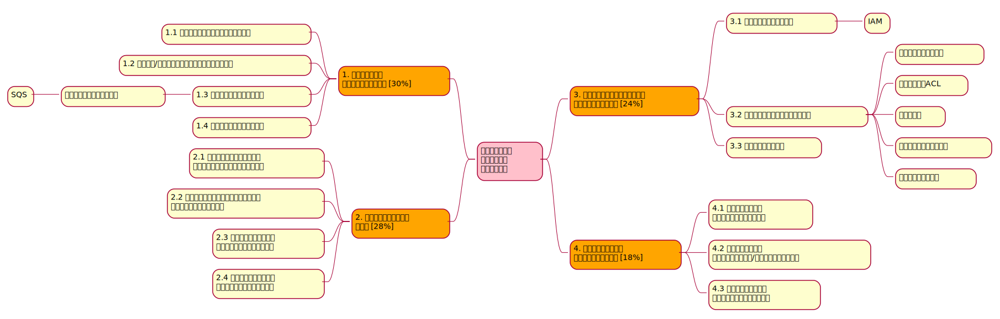

# 1. AWS試験の概要

## 試験の概要
https://aws.amazon.com/jp/certification/certified-solutions-architect-associate/

* 形式: 65個の設問（単一回答または複数選択）
* 時間: 130分
* 価格: 150 USD
* 受験方法: ピアソンVUEおよびPSIのテストセンター、またはオンラインの監督付き試験
* 合格ライン：720点（得点範囲：100~1000点）

## 出題範囲

| 分野 | 試験の割合 |
|--|--|
| 1.弾力性に優れたアーキテクチャ設計 | 30% |
| 2.高パフォーマンスなアーキテクチャ設計 | 28% |
| 3.セキュアなアプリケーション/アーキテクチャ設計 | 24% |
| 4.コストを最適化したアーキテクチャ設計 | 18% |

## 対象サービス
https://d1.awsstatic.com/ja_JP/training-and-certification/docs-sa-assoc/AWS-Certified-Solutions-Architect-Associate_Exam-Guide.pdf

* アナリティクス
    * Athena
    * Elasticsearch Service
    * EMR
    * Glue
    * Kinesis
    * QuickSight
* 請求とコスト管理
    * Budgets
    * Cost Explorer
* インテグレーション
    * SNS
    * SQS
    * (SES)
    * (MQ)
* コンピューティング
    * EC2
    * Elastic Load Balancing
    * Auto Scaling
    * ECS
    * EKS
    * Fargate
    * Lambda
* データベース
    * Aurora
    * DynamoDB
    * ElastiCache
    * RDS
    * Redshift
* マネジメント/ガバナンス
    * プロビジョニング
        * Elastic Beanstalk
        * OpsWorks
        * CloudFormation
        * SAM
    * Backup
    * CloudTrail
    * CloudWatch
    * Config
    * EventBridge
    * AWS Origanizations
    * Resource Access Manager
    * Systems Manager
    * Trusted Advisor
* マイグレーション
    * DMS
    * DataSync
    * Migration Hub
    * Server Migration Service
    * Snowball
    * Transfer Family
    * VM Import/Export
* ネットワーク/コンテンツ配信
    * VPC（および関連機能）
    * Direct Connect
    * Site-to-Site VPN
    * Transit Gateway
    * Route 53
    * CloudFront
    * Global Accelerator
    * API Gateway
    * AppSync
* セキュリティ/権限管理/コンプライアンス
    * AWS Certificate Manager（ACM）
    * Directory Service
    * GuardDuty
    * IAM
    * Inspector
    * Key Management Service（KMS）
    * Macie
    * Secrets Manager
    * Shield
    * Single Sign-On
    * WAF
* ストレージ
    * S3/Glacier
    * EBS
    * EFS
    * FSx
    * Storage Gateway
