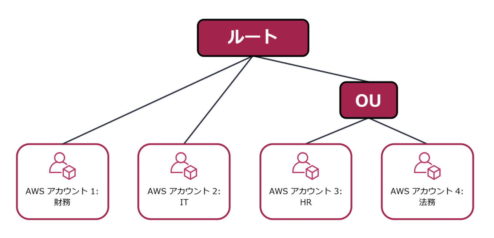

# マネジメント/ガバナンス

## CloudTrail
ユーザー単位でログ証跡を取得・集約

## AWS Organization
AWS Organizationsを使用すると、保有している複数アカウント群をー元的に管理することができる。

### OU（Organization Unit：組織単位）

管理しているアカウントのうちの複数を組織単位（OU：Organization Unit）にグループ化できる。

### SCP（Service Control Policy）
* OUまたは個別アカウントに指定するポリシーで、OU／アカウントで実行できるサービスやアクションを制限できる
* SCPとIAMを組み合わせることで柔軟なアクセス権限の管理が可能に
  - 親アカウントからSCPで大まかに権限を振り、OU（子アカウント）のIAMで細かく権限を振るなど

## Systems Manager
* 構築済みのインフラストラクチャを可視化し、制御するためのサービス
* 統一されたUIを介して複数のAWSサービスからの運用データを表示し、運用タスクを自動化することが可能

## Trusted Advisor
* AWS環境を検査し、AWSのベストプラクティスに基づいてリアルタイムの推奨事項を提供するサービス
* 評価する5つのカテゴリ
  - コスト最適化
  - パフォーマンス
  - セキュリティ
  - 耐障害性
  - サービスの制限

## AWS Config

* AWSリソースの設定から、AWSリソースの構成情報のスナップショットを取得・管理
* この構成情報を元に、現状のAWSリソースの設定が、利用者によって定義された正しい状態になっているかを評価
