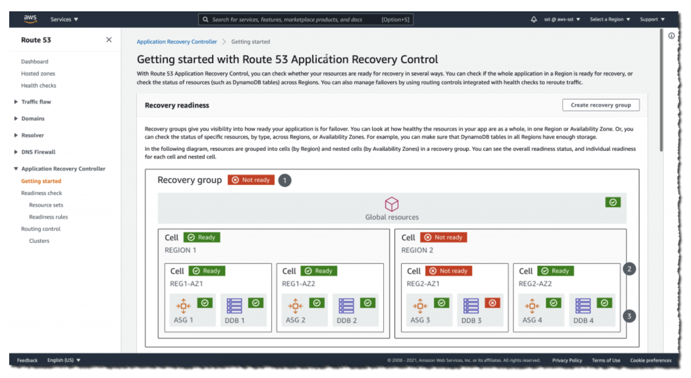
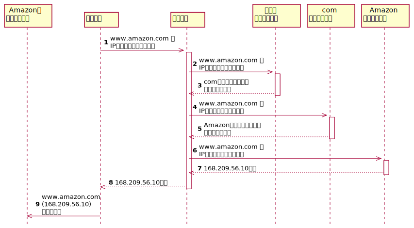

# ネットワーク/コンテンツ配信

---
## VPC（および関連機能）
* VPC: Vitual Private Cloud
* AWSリソースに対する境界を確立するために使用できるネットワークサービス
* CIDRでIPアドレスの範囲を定義 (ex `10.0.0.0/16`)
  * サブネットマスクの範囲は `/16〜/28` 
* 複数のAZにまたがることが可能
* DNS hostnamesオプション：有効にするとサブネット内のインスタンスにDNSホスト名が付与される

### VPCの主要な構成要素

#### サブネット
* セキュリティ・運用のニーズにもとづいてリソースをグループ化できるVPC内のセクション
* パブリックサブネット
  * パブリックに公開されているリソースが含まれる
  * インターネットゲートウェイに対しての経路を持つルートテーブルに関連付けられる
* プライベートサブネット
  * プライベートネットワークを介してのみアクセス可能なリソースが含まれる
  * プライベートサブネットからインターネットに接続するためには、パブリックサブネットに**NATゲートウェイ**を設置する
* VPC内ではサブネットは相互に通信できる
* ルートテーブル
  * サブネットの経路を定義。サブネット毎に設定が必要

#### ネットワークACL
* ACL=アクセスコントロールリスト
* **サブネット単位**でインバウンド/アウトバウンドトラフィックを制御する仮想ファイアウォール
* 各アカウントにはデフォルトのネットワークACLがあり、VPCを作成する際はデフォルトのネットワークACL or カスタムのネットワークACLを使用できる
  * デフォルトのネットワークACLは、**すべてのインバウンド/アウトバウンドトラフィックを許可する**
* ステートレスパケットフィルタリング
  * パケットはサブネットの境界（インバウンドとアウトバウンドの双方向）を出入りするたびにチェックされる

> インスタンスではなくサブネットを保護する場合は、ネットワークACLのインバウンドトラフィックを制御する

#### セキュリティグループ
* リソース単位でインバウンド/アウトバウンドのトラフィックを制御する仮想ファイアウォール
* デフォルトでは、**すべてのインバウンドトラフィックを拒否、すべてのアウトバウンドトラフィックを許可する**
* ステートフルパケットフィルタリング
  * 受信パケットに対して行われた以前の処理情報が保存される
  * 例えば、あるインスタンスから送信したリクエストに対するレスポンスがインスタンスに返される時、セキュリティグループはインバウンドルールに関係なくレスポンスの通信を通過させる

### VPCフローログ
* ENI（Elastic Network Interface）ごとに送信元/先のトラフィックログを取得・収集
* VPCフローログに伴う追加料金はなし
* 例えば、EC2インスタンスへのCloudWatchエージェントを導入することで、CloudWatchによるログの中央管理を実現できる

### IPフローティング
* インスタンスの障害発生時にElastic IPを即時に別のインスタンスに付け替える機能
* https://dev.classmethod.jp/articles/aws-cdp-floating-ip-pattern/

---
## Site-to-Site VPN
* https://docs.aws.amazon.com/ja_jp/vpn/latest/s2svpn/VPC_VPN.html
* AWSとオンプレ環境のVPN接続サービス
* 回線はインターネットを利用。IPsecをサポート
* AWS側には仮想ゲートウェイ（VGW：Virtual Private Gateway）、ユーザー側にはカスタマーゲートウェイ（Customer Gateway）を設定する
  * 参考： https://dev.classmethod.jp/articles/shibata-rtx830-create-vpn-site/

---
## Direct Connect
* https://aws.amazon.com/jp/directconnect/
* AWSとオフィス・データセンターなどの物理拠点を専用線で繋ぐサービス
* 接続速度は最大100Gbps。1Gbps/10Gbps/100GbpsのEtherポートを持つ専用線によりAWSとのリンクを確立

### Direct Connectローケーション

* ユーザー側はAWSと直接接続するわけではなく、Direct Connectローケーションを介してAWとと接続する
* Direct ConnectロケーションとAWSまでの回線はAWS側で用意。ユーザー拠点からDirect Connectロケーションまでの回線はユーザー側で用意
  + ただし、それを用意してくれるAPNパートナーもいる模様。 https://atbex.attokyo.co.jp/blog/detail/9/

---
## Transit Gateway

複数のVPCとオンプレミスを中央ハブを介して接続するサービス

### Trainsit GatewayとDirect Connectの相違点
* https://www.fujitsu.com/jp/solutions/infrastructure/construction/multi-cloud/aws/event-column/aws-transit-gateway.html
* 多対多の拠点接続が必要な場合はTransit Gatewayの方がメリットが大きい

| | Transit Gateway | Direct Connect |
| --- | --- | --- |
| VPC-VPC間の通信 | ○ | × |
| オンプレ-オンプレ間の通信 | ○ | × |
| VPC-オンプレ間の通信 | ○ | ○ |
| 複数のVPCの割り当て | ○ | ○ |
| 同じOrganizationsに属する必要性 | なし | なし |

---
## Route 53
* DNSの権威サーバの機能をマネジメント型でかんたんに提供
* 主要機能
  - ドメイン登録
  - DNSルーティング
  - ヘルスチェック
  - ポリシーによるルーティング設定
* 可用性100%のSLA。ユーザー側で冗長性の考慮が不要
* （DNSのキャッシュサーバの機能は持たない）

### 利用方法
1. Route 53にドメインを設定
2. ドメイン名と同じホストゾーンを自動設定
3. ホストゾーンにルーティング方法となるDNSレコードを作成
4. トラフィックルーティングを設定

### ホストゾーン
ドメイン（ex: example.com）とそのサブドメイン（ex: sub.example.com）のトラフィックのルーティングする方法についての情報を保持するコンテナ

* パブリックホストゾーン
  * インターネット上に公開されたDNSドメインレコードを管理するコンテナ
* プライベートホストゾーン
  * VPCに閉じたプライベートネットワークののDNSドメインレコードを管理するコンテナ
  * 1つのプライベートゾーンで複数のVPCに対応

### DNSレコード
主なレコード種別。他のレコードタイプは https://docs.aws.amazon.com/ja_jp/Route 53/latest/DeveloperGuide/ResourceRecordTypes.html

| 種別 | 内容 |
| --- | --- |
| SOA | ドメインのDNSサーバ/ドメイン管理者のメールアドレス/シリアル番号などを保持し、ゾーン転送時に情報が更新されているかの判断に利用
| A | ホスト名とIPv4アドレスの関連づけを定義。例： `1.1.1.1` ⇄ `example.com`）
| AAAA | ホスト名とIPv6アドレスの関連づけを定義
| CNAME | 正規ホスト名に対する別名を定義。例： `www.example.com` ⇄ `example.com`
| NS | ゾーン情報を管理するネームサーバを指定。例： `example.com` ⇄ `ns-604.awsdns-11.net`, `ns-283.awsdns-35.com`, `ns-226.awsdns.co.jp`
| MX | メールの配送先（メールサーバ）のホスト名を定義

### Aliasレコード
* Route 53固有の仮想リソースレコード
* DNSクエリにAWSサービスのエンドポイントのIPアドレスを返答
* メリット
  * DNSクエリに対するレスポンスが高速
  * CNAMEにマッピングできないZone Apexを設定可能
  * Aliasレコードに対するクエリが無料。Route 53と連携したDNS Lookupを高速化
  * CloudFrontでのクエリ回数を削減
* IPアドレスバージョンに応じたタイプ
  * IPv4アドレス： エイリアスターゲットのIPアドレスを伴うAレコード
  * IPv6アドレス： エイリアスターゲットのIPアドレスを伴うAAAAレコード

### トラフィックルーティング

| ポリシー | 内容 |
| --- | --- |
| シンプルルーティング（Simple） | レコードとエンドポイントを1対1での静的マッピング |
| 加重ルーティング（Weighted） | 複数エンドポイントがある場合、それらの重みづけを設定可能。加重を自由に設定できるため、**A/BテストやBlue／Greenデプロイメントに適している** |
| フェールオーバールーティング（Failover） | ヘルスチェックの結果にもとづいて利用可能なリソースをDNSクエリに応答 |
| 複数回答値ルーティング（Multivalue） | ランダムに選ばれた（最大8つの）別々のレコードを使用してIPアドレスを設定して複数の値を返答 |
| レイテンシールーティング（Latency） | リージョン間の遅延が少ない方へルーティング |
| 位置情報ルーティング（Geolocation） | ユーザーのIPアドレスにより位置情報を特定し地域ごとに異なるレコードを返す |
| 地理的近接性ルーティング | ユーザーとリソースの場所に基づいて地理的近接性ルールを作成してルーティング。AWSリソースを使用している場合はリソースを作成したリージョン、AWS以外のリソースを使用している場合はそのリソースの緯度・経度。トラフィックフローの利用が必要 |

https://zenn.dev/seyama/articles/02118b0914183e にも詳細な記述がある。

> DNSフェイルオーバーは異なるリージョンへの切り替えも可能
> https://dev.classmethod.jp/articles/route-53-dns-failover-ec2/

> また、加重ルーティングや複数値回答ルーティングを利用して、単一のDNSに対し複数のリソースを紐づけることで負荷分散を行うこともできる
> https://qiita.com/hotta/items/c43b547f5786731278de

### 冗長構成（フェールオーバー構成）

| 方式 | 内容 | 実装 |
| --- | --- | --- |
| アクティブ/パッシブ | プライマリリソースをアクティブなリソースとしてルーティング。障害が発生した場合、セカンダリーのリソースへルーティング | フェールオーバールーティングポリシーを適用 |
| アクティブ/アクティブ | 複数のリソースをアクティブとしてルーティング。障害が発生した場合、正常なリソースにフェールバック | **フェールオーバー以外の**ルーティングポリシーを適用（例えば、複数値回答ルーティング） |

> フェールオーバー構成というと、フェイルオーバーの具体的な手法ではなく、冗長構成を問われていることがあるので注意

### Route 53による地域制限
* 位置情報ルーティングで実現可能
* 地域を指定して配信先としての制限が可能
* コンテンツ配布のローカライズやローカルでのバフォーマンス向ななどに応用

### トラフィックフロー
* トラフィックフローにより視覚的なフローでの複雑なポリシー設置が可能に

### アプリケーションリカバリーコントローラ
https://aws.amazon.com/jp/blogs/news/amazon-route-53-application-recovery-controller/

* アクティブ/アクティブ構成以外でも最大限のフェールオーバー性能を実現可能に
* 独立したセル単位でリソースをセットし、復旧グループを構成して準備状況をチェックする

* リカバリーコントローラと他のフェイルオーバー手段の比較
  * アクティブ/パッシブなフェイルオーバーのRTOを高めるためにリカバリーコントローラを利用する
  * RTO（Recovery Time Objective）：システム障害発生時「どのくらいの時間で（いつまでに）」システムを復旧させるかの目標値

| 指標 | アクティブ/パッシブ | パッシブ/パッシブ | リカバリーコントローラ |
| --- | --- | --- | --- |
| RTO | 待機系もアクティブなため最大のRTOを達成　| 待機系は利用していないため、リソースの状況に応じてフェイルオーバーのRTOが決まる | 待機系の状態をコントロールし最適なリソース群にフェイルオーバーを実施することで**アクティブ/パッシブのRTOを最大化** |
| 利用するルーティングポリシー | フェイルオーバールーティング以外のポリシー（例：レイテンシールーティング） | フェイルオーバールーティングポリシー | 同左 |
| コスト・手間 | アクティブな構成を冗長化するため最も高コストになる可能性がある | 待機のの状態次第でコストを抑制できるが、**フェイルオーバーが遅れる可能性がある** | 人手を介さずにフェイルオーバーを最大化できる。リカバリーコントローラ自体はコスト不要 |

> こことは関係ないが、RTOと似た用語で「RPO」もある。
> 
> RPO（Recovery Point Objective）：障害発生時、過去の「どの時点まで」のデータを復旧させるか

### DNSファイアーウォール
Route 53 リソルバ経由のDNSクエリにもとづくサイトへの不正アクセスを制御し、DNSレベルの脅威を防ぐ

| 機能 | 内容 |
| --- | --- |
| DNS Firewall ルールグループ | DNSクエリをフィルタリングするためのルールのリスト |
| ドメインリスト | DNSフィルタリングを適用するドメインの集合をリスト。許可/拒否およびその両方を設定可能 |

### DNSの名前解決
* ドメインは階層構造
  * www.amazon.com なら root -> com -> amazon -> www のようなツリーになっている
* DNSの役割
  * ネームサーバ：インターネット上でドメインとWebサーバやメールサーバを結びつけるための名前解決を行うサーバ
  * リソルバ：ドメイン名に対応づけられたIPアドレスを問われた際に、ドメイン名に関連づけられたネームサーバを指定して、名前解決を行うサーバ

### Route 53 コンソール
#### ドメインの登録
ドメインの登録方法は次の2つ

1. Route 53でドメインを購入
    * Route 53コンソール上でドメインの購入が可能
    * 「ドメイン名の選択」で任意の文字列を入力すると、購入可能なドメイン一覧が表示される
    * 購入と同時にドメインが登録される
2. ホストゾーンの作成
    1. AWS以外のドメインポータルサイト（freenomやお名前.comなど）でドメインを取得
    2. Route 53でホストゾーンを作成
    3. Route 53でネームサーバのレコードを確認
    4. 1のドメインポータルサイトでネームサーバを設定（3のレコードを登録）
        * => 上位のネームサーバに順次登録されていく（24hくらいかかる）

#### ルーティングの設定
* シンプルルーティング
    * ドメインに紐づけるIPアドレスを設定
         * ex) EC2インスタンスのパブリックIPアドレス
    * 異なるリージョンのインスタンスを設定することも可能
         * ex) ホストゾーンの設定でレコードのトラフィックのルーティング先に各リージョンのインスタンスのパブリックIPアドレスを設定
         * ヘルスチェックがNGとなったターゲットにはルーティングされない
    * ELBをターゲットとする場合
         1. ホストゾーンの設定でレコードのトラフィックのルーティング先の「エイリアス」を有効化 -> Aliasレコードが有効になる
         2. 有効化すると、AWSリソースが選択可能になる
* 加重ルーティング
    * レコードに対しターゲットと加重をペアで設定
* レイテンシールーティング
    * レコードに対しターゲットとリージョンをペアで設定
* 位置情報ルーティング
    * レコードに対しターゲットのみを設定
    * 位置情報からのルーティングはAWSが自動的に行ってくれる
* 複数値回答ルーティング
    1. ターゲットに対してのヘルスチェックを作成
    2. レコードに対しターゲット、1で作成したヘルスチェックオプションを設定
       * ※ ヘルスチェックに失敗したターゲットはルーティングから除外される

---
## CloudFront
グローバルロケーションを使ってHTMLファイル・CSS・画像・動画といった静的コンテンツをキャッシュし、オリジンサーバーの代わりに配信するCDN（Content Delivery Network）サービス

### CloudFrontの特徴
* 世界中に120を超えるエッジロケーションが存在
* AWS WAF/Certificate Managerとの連携、DDoS対策によるセキュリティ機能
* オリジンサーバーに対してHeader/Cookie/Query Stringsによるフォワード指定で動的なページ配信が可能

### CloudFrontのバックエンド
https://aws.amazon.com/jp/cloudfront/

* エッジロケーション・エッジキャッシュ（単に「エッジ」とも呼ぶ）・オリジンサーバから構成される
    - コンテンツの初回取得はオリジンサーバに直接アクセス
    - また、コンテンツのTTLがすぎてエッジキャッシュがない場合は、オリジンサーバから取得。それ以外は、エッジキャッシュにアクセス
* オリジンサーバとして、S3（の静的ホスティング）・EC2・API Gateway・ELBを利用可能
* また、オンプレミスのサーバも指定できるため、既存のシステム構成に変更を加えることなくCloudFrontをを導入することで、イベントなどによる一時的にはアクセス増に備えるといった使い方も可能

### Gzip圧縮機能
* 配信処理コストを抑制するために、エッジロケーション側でファイル圧縮処理を行うことができる

### アクセス制限
* 署名付きURLと署名付きCookieにより配信コンテンツへのアクセスを詳細に制御
* オリジンへのアクセス制限
  * Original Access Identity（OAI）
    * S3へのアクセスをCloudFrontからのみに限定することができる機能
    * コンテンツにアクセス可能な日時やIPアドレスの制御が可能になる
  * カスタムヘッダー
    * ヘッダーに制約を設ける
  * ビューワープロトコルポリシー
    * ビューワーがCloudFrontにアクセスするのにHTTPSを使用しなければならないようにディストリビューションを設定
  * オリジンプロトコルポリシー
    * CloudFrontがビューワーと同じプロトコルを使用してリクエストをオリジンに転送するように、ディストリビューションを設定
* キャッシュのアクセス制限
  * 署名付きURL
    * コンテンツへの直接のURLではなく、署名付きURLからアクセスさせる
    * 個別のファイルへのアクセスを制限する場合（インストーラのDLなど）に利用する
    * ユーザーがCookieをサポートしていないクライアントを使用している場合に利用する
  * 署名付きCookie
    * 署名付きCookieからのみアクセスさせる
      * Set-Cookieヘッダにポリシー（有効期限やソースIP）、署名、キーペアIDを付与させる
    * 複数の制限されたファイル（ウェブサイトの購読者の領域にあるファイルなど）へのアクセスを提供する場合に利用
    * 現在のURLをしたくない場合に利用

---
## Global Accelerator

---
## API Gateway
* サーバレスでAPIゲートウェイサービスを実現可能
* 最大数十万規模の同時APIコールを処理できる
* トラフィック管理、認可とアクセス制御、モニタリング、バージョン管理などの機能を備える
* HTTP API/REST APIに関しては、受信したAPIコール数と転送データ量に対してのみ料金が発生
* 内部処理はLambda関数によるコーディングと統合させる必要がある

### スロットリングの利用
多すぎるリクエストに制限をかけることで、トラフィックの急増に対してバックエンドを守る

| 機能 | 内容 |
| --- | --- |
| サーバ側のスロットリング制限 | すべてのクライアントに対するリクエストを制限する |
| クライアント単位のスロットリング制限 | クライアントごとに「使用量プラン」に応じて制限を行う。特定ユーザーからのリクエストが多い場合に有効 |

---
## AppSync
* https://aws.amazon.com/jp/appsync/
* GraphQL APIの開発を容易にするフルマネージドサービス
