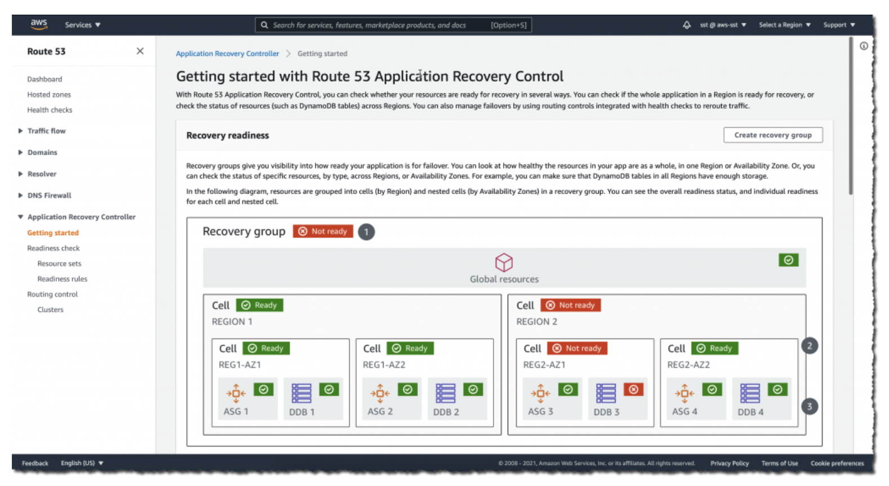
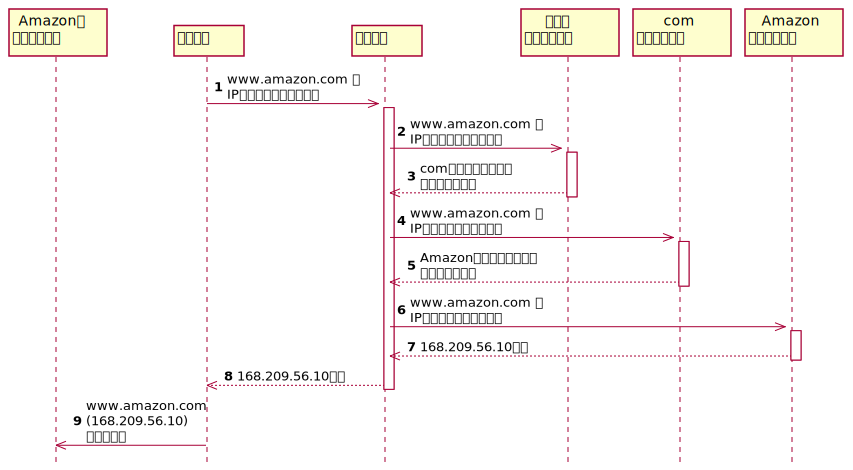

# ネットワーク/コンテンツ配信

---
## Route 53
### Route 53の概要
#### DNS
* 権威サーバ
* キャッシュサーバ

#### Route 53
* 権威サーバの機能をマネジメント型でかんたんに提供
* 主要機能：ドメイン登録/DNSルーティング/ヘルスチェック
* ポリシーによるルーティング設定
* 可用性100%のSLA（AWSが保証）
* マネージドサービスのためユーザー側で冗長性の考慮が不要

#### 利用方法
1. Route 53にドメインを設定
2. ドメイン名と同じホストゾーンを自動設定
3. ホストゾーンにルーティング方法となるDNSレコードを作成
4. トラフィックルーティングを設定

#### ホストゾーン
ドメイン（ex: example.com）とそのサブドメイン（ex: sub.example.com）のトラフィックのルーティングする方法についての情報を保持するコンテナ

* パブリックホストゾーン
  * インターネット上に公開されたDNSドメインレコードを管理するコンテナ
* プライベートホストゾーン
  * VPCに閉じたプライベートネットワークののDNSドメインレコードを管理するコンテナ
  * 1つのプライベートゾーンで複数のVPCに対応

#### DNSレコード
主なレコード種別。他のレコードタイプは
https://docs.aws.amazon.com/ja_jp/Route 53/latest/DeveloperGuide/ResourceRecordTypes.html

| 種別 | 内容 |
| --- | --- |
| SOA | ドメインのDNSサーバ/ドメイン管理者のメールアドレス/シリアル番号などを保持し、ゾーン転送時に情報が更新されているかの判断に利用
| A | ホスト名とIPアドレスの関連づけを定義
| MX | メールの配送先（メールサーバ）のホスト名を定義
| CNAME | 正規ホスト名に対する別名を定義

#### Aliasレコード
* Route 53固有の仮想リソースレコード
* DNSクエリにAWSサービスのエンドポイントのIPアドレスを返答
* メリット
  * DNSクエリに対するレスポンスが高速
  * CNAMEにマッピングできないZone Apexを設定可能
  * Aliasレコードに対するクエリが無料。Route 53と連携したDNS Lookupを高速化
  * CloudFrontでのクエリ回数を削減

#### トラフィックルーティング

| ポリシー | 内容 |
| --- | --- |
| シンプルルーティング（Simple） | レコードとエンドポイントを1対1での静的マッピング |
| 加重ルーティング（Weighted） | 複数エンドポイントがある場合、それらの重みづけを設定可能 |
| フェールオーバールーティング（Failover） | ヘルスチェックの結果にもとづいて利用可能なリソースをDNSクエリに応答 |
| 複数回答値ルーティング（Multivalue） | ランダムに選ばれた（最大8つの）別々のレコードを使用してIPアドレスを設定して複数の値を返答 |
| レイテンシールーティング（Latency） | リージョン間の遅延が少ない方へルーティング |
| 位置情報ルーティング（Geolocation） | ユーザーのIPアドレスにより位置情報を特定し地域ごとに異なるレコードを返す |
| 地理的近接性ルーティング | ユーザーとリソースの場所に基づいて地理的近接性ルールを作成してルーティング。AWSリソースを使用している場合はリソースを作成したリージョン、AWS以外のリソースを使用している場合はそのリソースの緯度・経度。トラフィックフローの利用が必要 |

#### フェールオーバー構成

| タイプ | 内容 |
| --- | --- |
| アクティブ/パッシブ | プライマリリソースをアクティブなリソースとしてルーティング。障害が発生した場合、セカンダリーのリソースへルーティング |
| アクティブ/アクティブ | 複数のリソースをアクティブとしてルーティング。障害が発生した場合、正常なリソースにフェールバック |

#### Route 53による地域制限
* 位置情報ルーティングで実現可能
* 地域を指定して配信先としての制限が可能
* コンテンツ配布のローカライズやローカルでのバフォーマンス向ななどに応用

#### トラフィックフロー
* トラフィックフローにより視覚的なフローでの複雑なポリシー設置が可能に

#### アプリケーションリカバリーコントローラ
https://aws.amazon.com/jp/blogs/news/amazon-route-53-application-recovery-controller/

* アクティブ/アクティブ構成以外でも最大限のフェールオーバー性能を実現可能に
* 独立したセル単位でリソースをセットし、復旧グループを構成して準備状況をチェックする

* リカバリーコントローラと他のフェイルオーバー手段の比較
  * アクティブ/パッシブなフェイルオーバーのRTOを高めるためにリカバリーコントローラを利用する
  * RTO（Recovery Time Objective）：システム障害発生時「どのくらいの時間で（いつまでに）」システムを復旧させるかの目標値

| 指標 | アクティブ/パッシブ | パッシブ/パッシブ | リカバリーコントローラ |
| --- | --- | --- | --- |
| RTO | 待機系もアクティブなため最大のRTOを達成　| 待機系は利用していないため、リソースの状況に応じてフェイルオーバーのRTOが決まる | 待機系の状態をコントロールし最適なリソース群にフェイルオーバーを実施することで**アクティブ/パッシブのRTOを最大化** |
| 利用するルーティングポリシー | フェイルオーバールーティング以外のポリシー（例：レイテンシールーティング） | フェイルオーバールーティングポリシー | 同左 |
| コスト・手間 | アクティブな構成を冗長化するため最も高コストになる可能性がある | 待機のの状態次第でコストを抑制できるが、**フェイルオーバーが遅れる可能性がある** | 人手を介さずにフェイルオーバーを最大化できる。リカバリーコントローラ自体はコスト不要 |

> こことは関係ないが、RTOと似た用語で「RPO」もある。
> 
> RPO（Recovery Point Objective）：障害発生時、過去の「どの時点まで」のデータを復旧させるか

#### DNSファイアーウォール
Route 53 リソルバ経由のDNSクエリにもとづくサイトへの不正アクセスを制御し、DNSレベルの脅威を防ぐ

| 機能 | 内容 |
| --- | --- |
| DNS Firewall ルールグループ | DNSクエリをフィルタリングするためのルールのリスト |
| ドメインリスト | DNSフィルタリングを適用するドメインの集合をリスト。許可/拒否およびその両方を設定可能 |

### DNSの名前解決
* ドメインは階層構造
  * www.amazon.com なら root -> com -> amazon -> www のようなツリーになっている
* DNSの役割
  * ネームサーバ：インターネット上でドメインとWebサーバやメールサーバを結びつけるための名前解決を行うサーバ
  * リソルバ：ドメイン名に対応づけられたIPアドレスを問われた際に、ドメイン名に関連づけられたネームサーバを指定して、名前解決を行うサーバ

### Route 53 コンソール
#### ドメインの登録
ドメインの登録方法は次の2つ

1. Route 53でドメインを購入
    * Route 53コンソール上でドメインの購入が可能
    * 「ドメイン名の選択」で任意の文字列を入力すると、購入可能なドメイン一覧が表示される
    * 購入と同時にドメインが登録される
2. ホストゾーンの作成
    1. AWS以外のドメインポータルサイト（freenomやお名前.comなど）でドメインを取得
    2. Route 53でホストゾーンを作成
    3. Route 53でネームサーバのレコードを確認
    4. 1のドメインポータルサイトでネームサーバを設定（3のレコードを登録）
        * => 上位のネームサーバに順次登録されていく（24hくらいかかる）

#### ルーティングの設定
* シンプルルーティング
    * ドメインに紐づけるIPアドレスを設定
         * ex) EC2インスタンスのパブリックIPアドレス
    * 異なるリージョンのインスタンスを設定することも可能
         * ex) ホストゾーンの設定でレコードのトラフィックのルーティング先に各リージョンのインスタンスのパブリックIPアドレスを設定
         * ヘルスチェックがNGとなったターゲットにはルーティングされない
    * ELBをターゲットとする場合
         1. ホストゾーンの設定でレコードのトラフィックのルーティング先の「エイリアス」を有効化 -> Aliasレコードが有効になる
         2. 有効化すると、AWSリソースが選択可能になる
* 加重ルーティング
    * レコードに対しターゲットと加重をペアで設定
* レイテンシールーティング
    * レコードに対しターゲットとリージョンをペアで設定
* 位置情報ルーティング
    * レコードに対しターゲットのみを設定
    * 位置情報からのルーティングはAWSが自動的に行ってくれる
* 複数値回答ルーティング
    1. ターゲットに対してのヘルスチェックを作成
    2. レコードに対しターゲット、1で作成したヘルスチェックオプションを設定
       * ※ ヘルスチェックに失敗したターゲットはルーティングから除外される

#### フェイルオーバー(アクティブ/アクティブ)の設定
* 複数値回答ルーティングもフェイルオーバー(アクティブ/アクティブ)のひとつ
* 以下、レイテンシールーティングでの設定

---
## CloudFront
* HTMLファイル・CSS・画像・動画といった静的コンテンツをキャッシュし、オリジンサーバーの代わりに配信するCDN（Content Delivery Network）サービス
* CloudFrontは世界中に120を超えるエッジロケーション

### CloudFrontのバックエンド
出展： https://aws.amazon.com/jp/cloudfront/

* エッジロケーション・エッジキャッシュ（単に「エッジ」とも呼ぶ）・オリジンサーバから構成される
    - コンテンツの初回取得はオリジンサーバに直接アクセス
    - また、コンテンツのTTLがすぎてエッジキャッシュがない場合は、オリジンサーバから取得
    - それ以外は、エッジキャッシュにアクセス
* オリジンサーバとして、S3（の静的ホスティング）・EC2・API Gateway・ELBを利用可能
* また、オンプレミスのサーバも指定できるため、既存のシステム構成に変更を加えることなくCloudFrontをを導入することで、イベントなどによる一時的にはアクセス増に備えるといった使い方も

